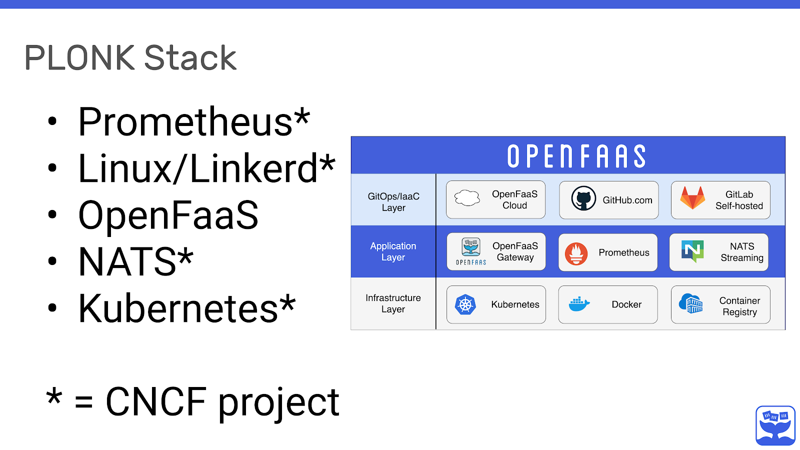
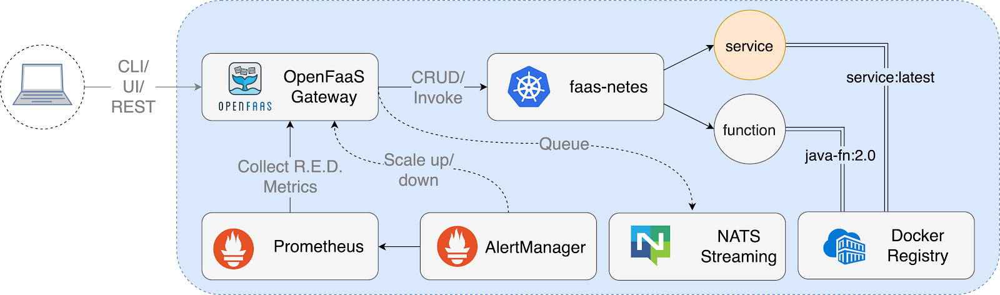

We now have a broad overview of what Serverless and FaaS mean and where they fit within the CNCF ecosystem. We also have a good general overview of the various serverless projects. For the remainder of this course, we will focus on OpenFaaS. So let’s start familiarizing ourselves with the approach it takes and some of its moving parts.

By the end of this chapter, you should be able to:

- Understand the philosophy behind the CNCF and how OpenFaaS embraces the same approach.
- Discuss what PLONK stands for, and why it’s important for application developers.
- Understand the conceptual architecture of OpenFaaS and how it uses various OSS projects from the CNCF.

## More on OpenFaas

Now, OpenFaaS is built by a core group of independent developers who have a strong interest in making serverless portable and accessible by its users. The tagline of OpenFaaS is “Serverless Functions Made Simple”; judging by the number of conference talks, meetups, blog posts and case studies published, OpenFaaS is delivering on that.

- You can learn more about community events, blog posts, and meetups on the [OpenFaaS Community page on GitHub](https://github.com/openfaas/faas/blob/master/community.md).
- You can learn more about the commercial adopters on the [Adopters page on GitHub](https://github.com/openfaas/faas/blob/master/ADOPTERS.md).

## What Is PLONK?

Part of the CNCF philosophy is to provide a set of complementary projects and tools designed to work with cloud computing. Cloud native projects work well together when they are designed to solve a single, well-defined problem. This means that other projects can compose and extend prior innovation to move fast. Using existing cloud native projects was important for OpenFaaS, and you will see from the diagram below how OpenFaaS fits together with the ecosystem.

When Prometheus, Linux, OpenFaaS, NATS and Kubernetes are combined, we get the PLONK stack, much like LAMP (Linux, Apache, MySQL, and PHP) or JAM (JavaScript APIs Markdown).

The PLONK stack also requires components like a Container Registry and Container Runtime such as [Docker](https://www.docker.com/) or [Containerd](https://containerd.io/). You can then build on top of it by introducing new projects, such as OpenFaaS Cloud, GitHub and GitLab.

The PLONK Stack is a series of open source projects that, when combined, provide a stack for Application Developers to use to write applications quickly - whether functions or microservices. You can read an introduction to the PLONK stack in this blog article.

Let's take a closer look at the PLONK stack, starting at the bottom and working our way up.

### Infrastructure Layer

- Docker provides a packaging image format, which is portable between clouds, unlike “Serverless 1.0” and cloud functions.
- A container registry holds each version of our function, meaning that we can version it and benefit from distribution, security scanning and many other features of projects like the CNCF [Harbor](https://goharbor.io/) registry.
- [Kubernetes](https://kubernetes.io/) provides a control plane to run our functions, including fail-over, high availability (HA), scale-out and secret management.

### Application Layer

- The [OpenFaaS Gateway](https://docs.openfaas.com/architecture/gateway/) is conceptually similar to a reverse proxy like [Nginx](https://www.nginx.com/), [Kong](https://konghq.com/kong/) or [Caddy](https://caddyserver.com/); however, its job is to expose and manage containers running our functions, rather than REST APIs. - It does have its own REST API and can be automated. The most popular client for the OpenFaaS Gateway is the CLI (faas-cli), followed by the UI.
- [Prometheus](https://prometheus.io/) is a CNCF project which provides metrics and instrumentation. It can be used to help inform autoscaling decisions, along with understanding the health and performance of OpenFaaS and our set of functions. AlertManager comes with Prometheus and is used to fire off scaling alerts or to notify us about a function which may be failing.
- [NATS](https://nats.io/) is another CNCF project which, when combined with OpenFaaS, provides a way to queue up requests and defer them for later execution. Each request can be deferred and run as there is capacity within the cluster, without the developer writing any additional code.

### GitOps/IaaC Layer

- [OpenFaaS Cloud](https://github.com/openfaas/openfaas-cloud) orchestrates all the lower layers to provide a multi-user dashboard with authentication, built-in CI/CD and integration to GitHub or GitLab.
- GitHub can be used to build and deploy functions using its Travis integration, or its own GitHub actions and container registry.
- GitLab comes with a full suite of GitOps-like tooling that can be used to create build and deployment pipelines directly into OpenFaaS.

In conclusion, OpenFaaS is able to leverage many open source projects and components to build a composable architecture and allow the operator maximum control and flexibility. In this course, we will focus primarily on the Application Layer.

## Conceptual Architecture for OpenFaaS

The following diagram represents the conceptual architecture for OpenFaaS.

In the diagram above, we zoom into the Application Layer to show the various components working together. You will notice that each function is a Docker image, which means it needs a name and a tag. The tag can be used for version control with semver, or other conventions. One of the endpoints is a service, which goes to show that microservices and functions can co-exist and work well together within Serverless.

All interaction with OpenFaaS happens through its REST API, and there is a [Swagger definition](https://docs.openfaas.com/architecture/gateway/#swagger) you can use if you want to dig deeper.

The documentation also lists the built-in [metrics](https://docs.openfaas.com/architecture/metrics/) available through Prometheus.

The core functionality provided by the OpenFaaS Gateway is to:

- Create, list, update and delete functions.
- Scale function replicas.
- Invoke a function.
- Query the health, metrics, and scaling status of functions.
- Create, list and delete secrets.
- View the logs from functions.
- Queue-up asynchronous requests.
The three ways of interacting with the REST API tend to be:

- Using the CLI (faas-cli).
- Using the built-in UI.
- Or via the REST API directly from your application or via cURL.

## Events, Triggers, and Invocations

All communication within OpenFaaS happens over HTTP using REST. This simple interface is made powerful when coupled with events and [triggers](https://docs.openfaas.com/reference/triggers/).

The OpenFaaS documentation lists several community and official triggers for OpenFaaS. A trigger is a way to invoke a function, with a simple HTTP call being the simplest option.

Most triggers in OpenFaaS are built with the **connector-sdk**, an open source add-on that lets developers write simple connectors between an event source and functions.

Examples of triggers include:

- Apache Kafka - a popular pub/sub system used by enterprise companies
- cron - time-based invocation
- SQS - trigger via AWS SQS
- NATS - a high-speed messaging CNCF project
- Minio - an open source S3 replacement and object store
- RabbitMQ - a traditional message queue
- MQTT - a pub/sub system often used with IoT devices.

Functions can also be invoked using the built-in asynchronous mechanism provided by OpenFaaS, which we will explore in the following chapters.

You can find a complete list of [triggers](https://docs.openfaas.com/reference/triggers/), and a link for the connector-sdk in the documentation.
