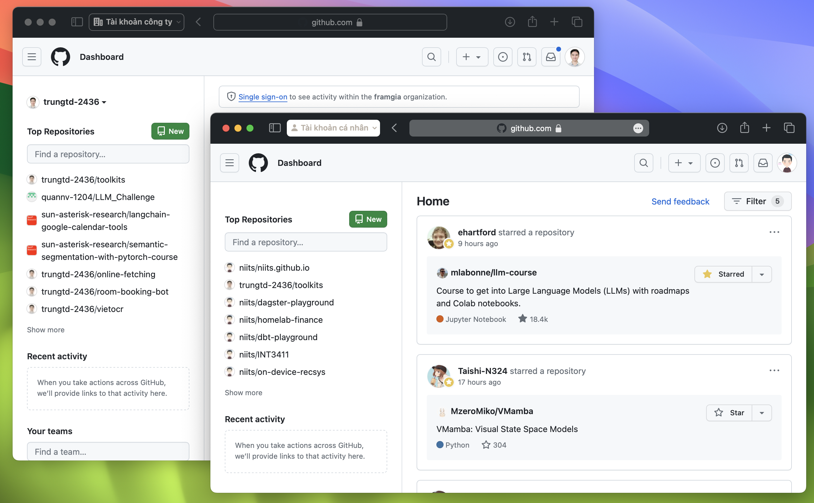

À thì mình thấy mọi người hay bảo làm dev, cũng mua Macbook tại vì nó hỗ trợ công việc cực kỳ tốt. Sau gần 6 tháng dùng, từ một windows/ubuntu user kỳ cựu thì mình đã trở thành một Apple con chính hiệu vì những tính năng xịn xò mà hệ sinh thái này mang lại. Bài viết này sẽ giới thiệu về cách sử dụng Focus trên MacOS cùng với Safari để tối ưu quá trình làm việc, nó hoạt động như thế nào thì mọi người cùng theo dõi nhé.

Sơ qua về bối cảnh một chút thì hiện tại mình đang làm remote tại một công ty IT, và như bao công ty các, mình được cấp tài khoản Google và Github riêng và sẽ không sử dụng tài khoản cá nhân của bản thân. Google thì không nói làm gì vì hệ thống này có hỗ trợ đa tài khoản, nhưng Github thì lại không hỗ trợ. Thành ra mình phải cài hai trình duyệt trên máy, rồi tự nhớ là tài khoản công ty thì đăng nhập ở Safari còn tài khoản cá nhân thì đang trên Chrome. Không chỉ vậy, vấn đề này cũng xuất hiện khi mình đăng nhập vào AWS Console hay Azure Portal. Nói chung là cũng khá là phiền.

Rồi cũng đến một ngày mình vọc ra Safari profiles. Chức năng này khá giống những gì mình muốn khi hai profiles sẽ có thể mở ở hai cửa số khác nhau. Chúng sẽ không chia sẻ `History, cookies, and other website data` vậy nên mình có thể giữ hai tài khoản Github được đăng nhập trên hai profiles khác nhau.

Tất nhiên là mọi người sẽ nói là thế thì nó khác đ gì dùng 2 trình duyệt. Tất nhiên rồi nếu dùng nguyên Safari profiles thì chẳng nói làm gì, tuy nhiên MacOS cho phép ta filter các Safari profile cho từng Focus mode cụ thể kiểu như thế này.

Quá xịn xD. Thế nên cùng với việc đặt lịch bật/tắt các focus tự động thì Safari sẽ tự động mở window mới với profile phù hợp khi đang trong giờ làm việc, chẳng cần phải click chuyển profile hay mở trình duyệt khác nên mình thấy tiện hơi rất nhiều xD,

À hiện tại thì vẫn có điểm trừ nhỏ là link từ nguồn thứ 3 sẽ được mở bằng profile gần đây nhất, nếu không có profile đang mở thì link đó sẽ được mở bằng profile mặc định vậy nên ta cần lưu ý là nên để một window của Safari luôn mở để không bị mất công chuyển nhé. Nói chung MacOS hoàn hảo quá thì khó có thể ra được bản update mới (và bóp hiệu năng máy cũ), thế nên ta tạm chấp nhận cũng không sao. Bài viết đến đây là kết thúc, cảm ơn mọi người đã dành thời gian đọc.
