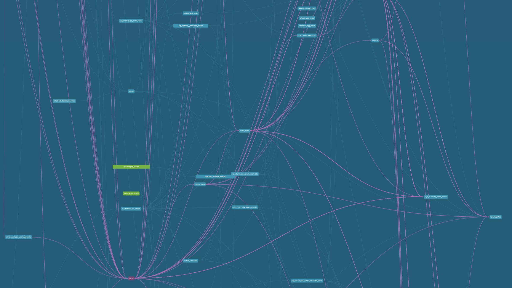
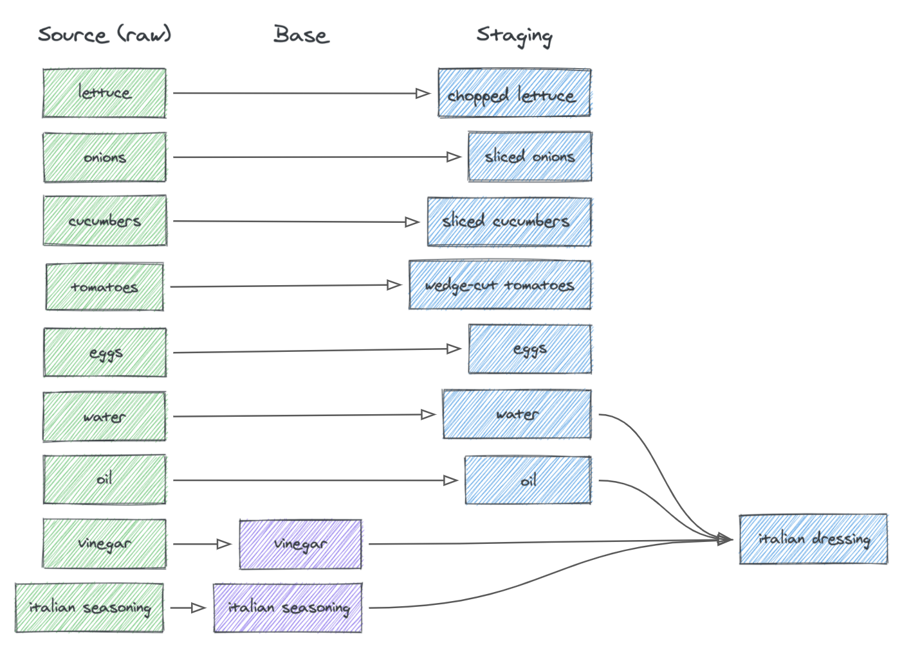

Sau gần 3 năm làm thợ gõ phím, tôi nhận ra rằng mỗi lần làm dự án là một lần để tôi nhận thấy mình code ngu như thế nào. (ﾒ﹏ﾒ)	 (ﾒ﹏ﾒ)	(ﾒ﹏ﾒ)

Và tất nhiên rồi, không chần chừ gì nữa, tôi xin phép giới thiệu đến quý đọc giả về **dbt (Data Build Tool)** - công cụ mà tôi ước giá như mình biết sớm hơn để công việc trong quá khứ trôi chảy hơn rất nhiều (b ᵔ▽ᵔ)b

# Một chút context

À thì cũng không phải tự nhiên mình mà mình có cơ hội làm quen với dbt mà câu chuyện cũng khá ly kì, kiểu như từ antifan số một của dbt thì mình đã trở thành fanboiz chính hiệu vậy.

Chắc là với việc làm một vài dự án outsource ở công ty cũng như các pet project ở nhà, thì mình có cơ hội làm một vài task giống như các Data Engineer/Data Analyst hay làm. Nhiệm vụ thì chủ yếu là với nguồn dữ liệu hiện có hoặc cần được thu thập thì mình sẽ cần tổ chức chúng thành các data warehouse, data mart phù hợp, cũng như thực hiện cài đặt các bước transform kiểu thêm cột thêm trường, group rồi cộng trừ nhân chia các thứ.

Và cũng giống tinh thần lượn qua một vòng Github xem gì dùng được không trước khi làm dự án, thì mình cũng có tìm hiểu xem mọi người hay dùng các công cụ gì để làm việc cho tiện. Tuy vậy thì khác với thái độ cho rằng Airflow là công cụ không thể thiếu để cài đặt các data pipeline, lúc đó mình lại nghĩ là **dbt thì có gì đâu mà phải dùng, nó khác moẹ gì bash scripting đâu nhỉ** và quyết định sẽ viết SQL chay thôi khỏi cần setup gì cho vất vả. Công việc thời gian đầu đơn giản nên chẳng có vấn đề gì, tuy nhiên thì càng về sau thì mình càng cảm nhận được các vấn đề của việc viết SQL nó nghiêm trọng như thế nào.

**Đầu tiên là câu lệnh quá dài và bị trùng code,** vâng sai lầm lớn nhất mà mình từng gặp là nhét hết logic cần được cài đặt vào một câu lệnh với một tỷ cái CTE, và việc đó dẫn đến khá nhiều hậu quả. Đầu tiên là nó khiến việc debug/sửa lỗi/cập nhật trên gần 700 dòng SQL trở thành một cực hình, và với một người có thể bị sảng bất cứ lúc nào như mình, thì nguy cơ sửa code đúng thành code sai khá cao, khiến cho thời gian tự kiểm tra cần đầu tư để đảm bảo code chạy đúng khá đáng kể. Tiếp theo đó là việc lặp lại khá nhiều CTE trong các câu lệnh SQL, mà không được cache kết quả khiến cho tổng thời gian thực thi khá cao, ảnh hưởng xấu đến cả yếu tố thời gian lẫn chi phí cần trả.


**Tất nhiên là nhiều bạn đọc đến đây sẽ nghĩ là "thế thì ông chạy CTE trước r lưu vào table mới đi, hoặc là tạo View là được, khóc lóc cái đ gì?"** Thì đúng rồi đó là cách giải quyết cho vấn đề ở trên nhưng ta lại có một vấn đề nữa là làm documents. Tất nhiên là làm tài liệu cho một vài data models sẽ chẳng có vấn đề gì nhưng khi số data model tăng dần lên thì công sức làm tài liệu lại tăng lên đáng kể, nhất là đối với người lười gõ phím và chỉ gõ được 3 ngón/bàn tay như mình (cấm cười)



Tôi khá là chắc kèo chẳng có ai nhìn được tên bảng dữ liệu nào trong cái hình minh hoạ ở trên. Hình ảnh này được tôi lấy từ bài viết [Data modeling techniques for more modularity](https://www.getdbt.com/analytics-engineering/modular-data-modeling-technique), thứ mà đã giúp tôi hiểu dbt có thể khiến công việc của mình trở nên dễ dàng hơn hàng nghìn lần như thế nào.

# Giới thiệu về dbt

Bài giới thiệu về dbt cũng khá nhiều rồi, thế nên tôi cũng không định giới thiệu chi tiết nữa. Với bài viết có thể xem tại https://tuananalytic.com/dbt-data-build-tool-la-gi/ thì ta có thể tóm tắt rằng:

> DBT hiện nay là công cụ hỗ trợ việc transform data bằng SQL phổ biến nhất hiện nay.
> 
> 
> Điều đặc biệt của DBT chính là việc DBT có thể giúp một analyst bình thường có thể thực hiện được công việc của một data engineer DBT giúp việc transform, document, test data trở nên dễ dàng hơn và có thể nhân rộng được.
> 
> Thực hiện các điều trên cũng trở nên đơn giản hơn thông qua việc sử dụng các công cụ của DBT chứ bạn không cần phải set up hệ thống test và viết document tách biệt.
> 

Khi nhìn vào nhìn vào mã nguồn của một project ví dụ của dbt, bạn sẽ thấy chúng được tạo bằng những đoạn code như thế này:

```
select *
from {{ ref('my_first_dbt_model') }}
where id = 1

```

Cú pháp `{{ ref(...) }}` mà các bạn nhìn thấy trong đoạn code trên chính là Jinja templating, thứ làm nên sức mạnh của dbt và cũng là thứ khiến mình nói rằng dbt không khác gì bash scripting trước đó. Chính việc có thể đặt reference này đã giúp ta có thể tái sử dụng code trong một project của dbt và nó cũng giúp ta tạo được các dependencies giữa chúng. Việc thiết kế đúng và sử dụng đúng dbt sẽ giúp ta tạo được đoạn mã sáng sủa và DAG cực kỳ tường minh như được thể hiện ở hình dưới đây.


Tất nhiên như vậy là chưa đủ để đảm bảo rằng đống DAG của ta sẽ không trở thành cái mạng nhện. Bằng cách sử dụng các khái niệm dành cho quá trình data modeling bao gồm base, staging, intermediate và cùng với các bảng fact/dimensional, dbt giúp ta tạo ra các mô hình dữ liệu tường minh, được document chi tiết và dễ dàng tái sử dụng.



Mã nguồn của bất kỳ dự án nào cũng khó có thể được tạo bởi một file duy nhất và dbt cũng không ngoại lệ. Vậy nên để có thể sắp xếp thư mục một cách khoa học và dễ hiểu, các bạn có thể tham khảo trang docs [How we structure our dbt projects](https://docs.getdbt.com/best-practices/how-we-style/1-how-we-style-our-dbt-models) nhé

```
models
├── intermediate
│   └── finance
│       ├── _int_finance__models.yml
│       └── int_payments_pivoted_to_orders.sql
├── marts
│   ├── finance
│   │   ├── _finance__models.yml
│   │   ├── orders.sql
│   │   └── payments.sql
│   └── marketing
│       ├── _marketing__models.yml
│       └── customers.sql
├── staging
│   ├── jaffle_shop
│   │   ├── _jaffle_shop__docs.md
│   │   ├── _jaffle_shop__models.yml
│   │   ├── _jaffle_shop__sources.yml
│   │   ├── base
│   │   │   ├── base_jaffle_shop__customers.sql
│   │   │   └── base_jaffle_shop__deleted_customers.sql
│   │   ├── stg_jaffle_shop__customers.sql
│   │   └── stg_jaffle_shop__orders.sql
│   └── stripe
│       ├── _stripe__models.yml
│       ├── _stripe__sources.yml
│       └── stg_stripe__payments.sql
└── utilities
    └── all_dates.sql

```

Tóm lại thì dbt có rất nhiều chức năng thú vị mà mình khó có thể giới thiệu hết trong một bài viết, tuy vậy thì những chức năng mà mình ấn tượng cũng như các tài liệu có liên quan của nó có thể kể đến như sau:

- Tạo DAG chỉ với SQL: dbt cho phép các analyst phát triển các model phức tạp và sát với nhu cầu business mà không cần phải nhờ đến Data Engineer, vốn không phải lúc nào cũng rảnh. dbt hỗ trợ hầu hết các data warehouse phổ biến hiện nay, danh sách chi tiết có thể tham khảo tại https://docs.getdbt.com/docs/supported-data-platforms
- Nâng tầm quá trình xây dựng data model: dbt cho phép ta cấu hình [Materializations](https://docs.getdbt.com/docs/build/materializations) (cách các bảng dữ liệu được xây dựng và lưu trữ) cũng như cách dữ liệu mới được xử lý thông qua các [Incremental models](https://docs.getdbt.com/docs/build/incremental-models), từ đó giúp ta tối ưu thời gian và chi phí tính toán thông qua cơ chế caching và filtering phù hợp.
- Định nghĩa các Data tests và Unit tests thông qua các file YAML như được đề cập trong https://docs.getdbt.com/docs/build/data-tests
- Dễ dàng định nghĩa các business metrics thông qua việc sử dụng [dbt Semantic Layer](https://docs.getdbt.com/docs/use-dbt-semantic-layer/dbt-sl)
- dbt Cloud giá cả cực kỳ phải chăng với IDE siêu xịn và hỗ trợ version controlling thông qua Git cũng như CI/CD tận răng

Đó chỉ là một số chức năng mà mình đã có cơ hội sử dụng, nhưng còn nhiều tính năng hấp dẫn khác như đặt hooks hoặc tạo các jinja macros để tái sử dụng mã. Các bạn nếu quan tâm thì có thể tìm hiểu chi tiết hơn tại trang docs của dbt https://docs.getdbt.com/ nhé.

# Tổng kết

Với một loạt các tính năng nổi bật được liệt kê ở trên, tôi nghĩ rằng bạn nên thử sử dụng dbt trong dự án của mình. Điều này đặc biệt đúng nếu bạn đang làm việc với lượng lớn dữ liệu và cần xây dựng các mô hình dữ liệu phức tạp. Bài viết đến đây là hết, cảm ơn mọi người đã dành thời gian đọc.