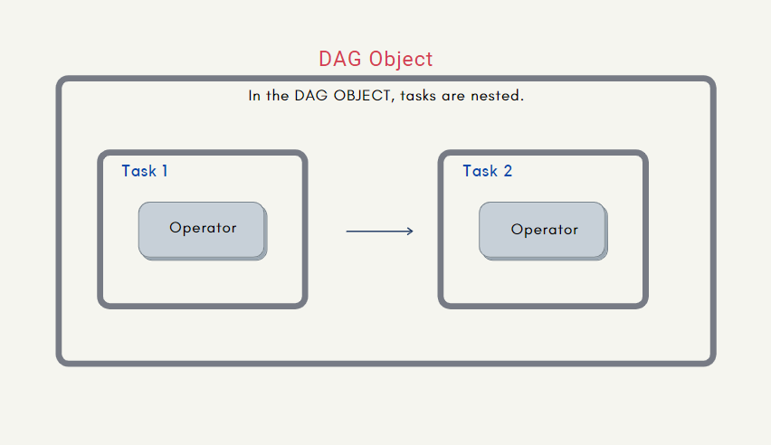
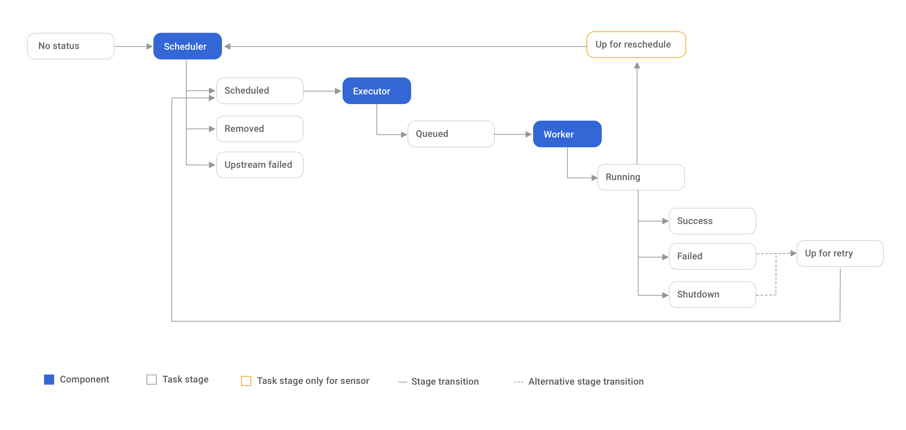
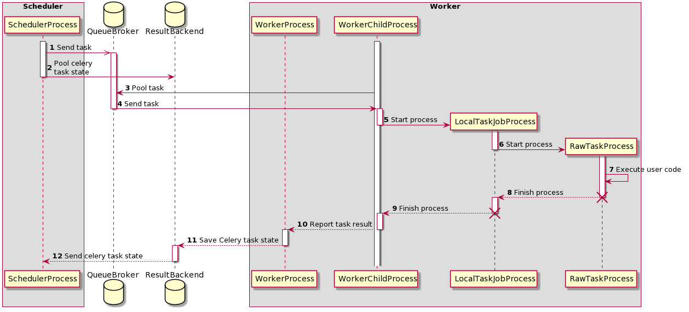

Airflow là một công cụ quản lý luồng dữ liệu phổ biến trong các hệ thống xử lý dữ liệu hiện đại. Tuy nhiên, việc sử dụng một tổ hợp nhiều thành phần như vậy đòi hỏi người dùng phải có nhiều kiến thức và kinh nghiệm để có thể sử dụng framework này một cách hiệu quả. Chính vì vậy, trong bài viết này, mình sẽ giới thiệu cho các bạn một số thứ cần quan tâm trong việc sử dụng Airflow, từ cách setup project sử dụng Airflow, viết DAG cho hiệu quả, cách kiểm thử với Airflow cho đến một số lưu ý tổng quát khác. Hy vọng những kiến thức được cung cấp trong bài viết này sẽ giúp bạn tiếp cận với Airflow một cách dễ dàng hơn và tối ưu hóa quá trình xử lý dữ liệu của mình.

# Airflow là gì?

Airflow là một công cụ quản lý luồng dữ liệu phổ biến trong các hệ thống xử lý dữ liệu hiện đại. Công cụ này giúp người dùng quản lý các quá trình xử lý dữ liệu một cách dễ dàng và hiệu quả hơn, nhất là khi nó hoàn toàn được viết bằng Python, một ngôn ngữ cực kỳ dễ học và có syntax khá sáng sủa. Trên Viblo có khá nhiều bài viết về Airflow chẳng hạn như bài của sếp mình tại [Tất tần tật về Airflow (P1)](https://viblo.asia/p/tat-tan-tat-ve-airflow-p1-L4x5xqPwKBM), nếu cần thì các bạn có thể đọc trước ở đó. Tuy vậy trước khi bắt đầu, ta sẽ remind lại một chút về cấu trúc một cụm Airflow như sau:


Như được thể hiện ở trên, một cụm Airflow là tổ hợp của khá nhiều thành phần mà trong đó sẽ là:

- Scheduler: Một trong những thành phần quan trọng nhất, xử lý cả việc kích hoạt workflow đã lên lịch và gửi Task cho executor để chạy.
- Executor các thành phần được sử dụng để chạy các Task, chúng có thể chạy trực tiếp trên Scheduler hoặc thực thi trên các Worker, tùy vào cách cấu hình
- WebServer: Chứa UI dạng Web được sử dụng để quản lý các Task, DagRun hoặc các giá trị của hệ thống

Phần lớn các công việc của ta cần thực hiện với Airflow sẽ là cài đặt các DAG (các đồ thị có hướng) bằng cách sắp xếp các các công việc (gọi là các Task) với thứ tự cụ thể bằng các sử dụng các Operator thích hợp. 



Để hệ thống Airflow có thể hoạt động thì ta cần đảm bảo rằng cả scheduler, web server và các worker đều có một phiên bản xác định về các DAG hiện có. Vậy nên phần cài đặt các DAG thường được đặt trong một thư mục và tất cả các dịch vụ trên đều được cấu hình để đọc DAG từ thư mục đó.


# Airflow hoạt động như thế nào?

Một yếu tố tiên quyết để đảm bảo rằng mình sử dụng đúng cách một công cụ là hiểu rõ cách hoạt động của nó. Hình dưới đây thể hiện quá trình mà hệ thống Airflow thực thi một task như thế nào



Như được thể hiện trong hình trên quá trình thực thi một task của Airflow bắt đầu bằng việc `scheduler` lấy các `task` chưa được thực thi hoặc được thực thi lại ra để xử lý. Khi đó những task có thể thực thi tức là không trong tình trạng cần được loại bỏ hoặc bỏ qua do các upstream task bị failed sẽ được gửi đến Executor và những tiếp đó chúng sẽ được `Executor` gửi đến các `Worker` thích hợp. Đến lúc này, một `TaskInstance` sẽ được tạo ra nhằm mục đích chứa trạng thái của quá trình thực thi task cũng như các thông tin khác, chẳng hạn như context của nó. Document cho các thông tin được chứa trong context như cách chúng được gán khá mơ hồ nên nếu có nhu cầu tìm hiểu thêm bạn có thể đọc tại cái issue dài 5 cái màn hình đặt dọc này nhé https://github.com/apache/airflow/issues/14396. Tiếp đó Airflow cho phép user render các giá trị tại thời điểm task instance được tạo thông qua Jinja templating, vậy nên bạn có thể tham khảo cách sử dụng chúng để code ngắn hơn tại [https://airflow.apache.org/docs/apache-airflow/stable/templates-ref.html](https://airflow.apache.org/docs/apache-airflow/stable/templates-ref.html)

Ok tiếp đó, ta có thể xét đến quá trình thực thi bằng một CeleryExecutor như sau:



Sequence diagram trên thể hiện quá trình một task được thực thi trên CeleryExecutor. Có khá nhiều thứ có thể thấy từ biểu đồ trên, tuy vậy ta có thể thấy rằng trong quá trình xử lý. Ta sẽ có hai tiến trình được khởi tạo, và đó là: 

- `LocalTaskJobProcess`: theo dõi RawTaskProcess.
- `RawTaskProcess`: thực thi các mã nguồn được định nghĩa bởi người dùng

Tạm thời bỏ qua `LocalTaskJobProcess` vì ta ít khi quan tâm đến cách Airflow theo dõi quá trình chạy của các task như thế nào, `RawTaskProcess` chính là nơi mà các mã nguồn của ta được thực thi, chẳng hạn như với `PythonOperator`, operator này sẽ đơn giản chỉ là chạy thuộc tính `python_callable`, chính là hàm khi ta truyền vào nếu khởi tạo hoặc là hàm được wrap trong decorator nếu như bạn dùng `@task` thay thế

```python
def execute_callable(self) -> Any:
        """
        Calls the python callable with the given arguments.
        :return: the return value of the call.
        """
        return self.python_callable(*self.op_args, **self.op_kwargs)
```

Vậy chắc hẳn các bạn cũng tự hỏi rằng với với các `python_callable` cần có tham số truyền vào thì operator sẽ lấy các `argument` từ đâu ra để truyền vào. Lúc này ta có thể đọc đến hàm ngay bên trên có tên là  [determine_kwargs](https://github.com/apache/airflow/blob/cb71d41c75ca1b2ddf06b383e767a25c817e5b9f/airflow/operators/python.py#L190), có tác dụng tạo ra các `argument` từ context của task và sử dụng ở các bước tiếp theo.

Tuy vậy thì một DAG sẽ không chỉ được tạo từ một task riêng biệt, chẳng hạn như một DAG được cài đặt như sau:

```python
@dag(
    "example_dag_basic",
    schedule="@daily",
    start_date=datetime(2023, 1, 1),
    catchup=False,
    default_args={"retries": 2},
    tags=["example"],
)
def example_dag_basic():
    @task()
    def extract():
        data_string = '{"1001": 301.27, "1002": 433.21, "1003": 502.22}'

        order_data_dict = json.loads(data_string)
        return order_data_dict

    @task(
        multiple_outputs=True 
    )
    def transform(order_data_dict: dict):
        total_order_value = 0
        for value in order_data_dict.values():
            total_order_value += value
        return {"total_order_value": total_order_value}

    @task()
    def load(total_order_value: float):
        print(f"Total order value is: {total_order_value:.2f}")
    order_summary = transform(extract())
    load(order_summary["total_order_value"])

example_dag_basic()
```

Với việc định nghĩa quan hệ hai task thông qua `transform(extract())`, chắc hẳn các bạn sẽ nghĩ rằng kết quả của task `extract` sẽ được truyền trực tiếp vào `transform` . Tuy vậy các truyền giá trị giữa các task được thực hiện qua việc push và pull XComs và đối với bộ phân tích cú pháp của Airflow thì `extract()` sẽ trả về một `XComArg` và đoạn mã `transform(extract())` sẽ được Airflow phân tích cú pháp như sau:

- Đầu tiên, thực thi task `extract` thông qua việc tạo một TaskInstance tương ứng, kết quả của task này mặc định sẽ được push thành XComs với key là return_value
- Tiếp theo, tạo TaskInstance cho task `transform` , thực hiện việc pull XCom có key là return_value từ TaskInstance của `extract` trong cùng DAG hiện tại và sử dụng nó làm đối số truyền vào python_callable để thực thi
- Sau khi thực thi xong, lấy từng giá trị trong dict trả về để push lên XComs với key tương ứng do task này có multiple_outputs nhận giá trị True

Quá trình phân tích cú pháp cũng diễn ra tương tự khi ta định nghĩ quan hệ giữa task transform và load, chỉ khác một chút là Airflow sẽ chỉ pull XCom có key là total_order_value để thực thi task load vì ta chỉ truyền order_summary["total_order_value"] vào load thay vì toàn bộ `XComArg` được trả về.

Xcoms là thành phần không thể thiếu để tạo lên khả năng xử lý phân tán của Airflow, vậy nên các bạn có thể tham khảo thêm tại [https://airflow.apache.org/docs/apache-airflow/stable/core-concepts/xcoms.html](https://airflow.apache.org/docs/apache-airflow/stable/core-concepts/xcoms.html) nhé
# Setup project sử dụng Airflow

Một dự án thành công sẽ bắt đầu bằng một code base chất lượng tốt. Trở lại cấu trúc một cụm Airflow, các bạn có thể thấy rằng chúng ta sẽ có ít nhất 4 dịch vụ riêng biệt (scheduler, worker, webserver, database) và sẽ là 5 nếu ta sử dụng CeleryExecutor vì ta sẽ cần một message queue nữa. Giả sử như bạn muốn tự cài đặt môi trường trực tiếp trên máy bạn thì tôi cũng không có gì để nói cả, tuy vậy nếu muốn setup một cách nhanh chóng hơn, ta có thể sử dụng docker-compose được viết sẵn của Airflow tại [https://airflow.apache.org/docs/apache-airflow/2.6.0/docker-compose.yaml](https://airflow.apache.org/docs/apache-airflow/2.6.0/docker-compose.yaml) Docker compose này sẽ chứa những thứ như sau:

- `airflow-scheduler` - scheduler giám sát tất cả các nhiệm vụ và DAG, sau đó kích hoạt các trường hợp nhiệm vụ khi các phụ thuộc của chúng hoàn thành.
- `airflow-webserver` - Máy chủ web có sẵn tại `http://localhost:8080`.
- `airflow-worker` - worker các task được giao bởi lập lịch.
- `airflow-triggerer` - Triggerer chạy một vòng lặp sự kiện cho các task có thể trì hoãn.
- `airflow-init` - Thực hiện các công việc để setup môi trường cũng như migrate database
- `postgres` - Cơ sở dữ liệu.
- `redis` - message queue để chuyển task từ scheduler đến worker

Tuy vậy, với việc sử dụng docker-compose như trên, ta cần có một số lưu ý như sau:

- Do thư mục DAG sẽ được mount vào trong các container (chi tiết vui lòng xem trong file [docker-compose.yaml](https://airflow.apache.org/docs/apache-airflow/2.6.0/docker-compose.yaml) ) vậy nên ta cần điều chỉnh một chút thông qua việc đặt biến môi trường `AIRFLOW_UID` để tránh các vấn đề liên quan đến quyền có thể phát sinh, nhất là với các file trong thư mục DAG
- Có thể bạn chưa biết thì các thành phần của airflow sẽ sử dụng chung một docker image. Vậy nên trong trường hợp cần tùy chỉnh hoặc cài đặt thêm các dependencies, cách tốt nhất với docker-compose được viết sẵn kia sẽ là build trước một custom image và để tên của nó vào file `.env`. Trong trường hợp bạn muốn test nhanh một thư viện nào đó, `PythonVirtualenvOperator` sẽ là lựa chọn thích hợp

Vậy còn lúc deploy thì sao, thông thường nếu không sử dụng các dịch vụ Airflow được cung cấp sẵn như [Amazon Managed Workflows for Apache Airflow (MWAA)](https://aws.amazon.com/managed-workflows-for-apache-airflow/) hay [Google Cloud Composer](https://cloud.google.com/composer) và [Azure Data Factory Managed Airflow](https://learn.microsoft.com/azure/data-factory/concept-managed-airflow) thì deploy dựa trên k8s sẽ là lựa chọn hàng đầu. Đơn giản vì thế kỷ 21 rồi, ai mà chẳng sử dụng Kubernetes. Việc sử Airflow trên Kubernetes sẽ có một số thứ cần quan tâm thêm, cụ thể như sau:

- Cài đặt như thế nào: Mình thường sử dụng một số chart được viết sẵn và chỉnh sửa chúng để phù hợp với nhu cầu của bản thân và team. Có rất nhiều phiên bản chart mà ta có thể tìm thấy, tuy nhiên nếu bạn muốn biết được nội dung chart đó viết gì thì mình nghĩ [https://github.com/airflow-helm/charts](https://github.com/airflow-helm/charts) sẽ là lựa chọn tốt
- Đồng bộ phiên bản DAG như thế nào: Thông thường thì không phải DAG cứ code phát là xong luôn mà ta sẽ cần chỉnh sửa chúng qua các phiên bản khác nhau. Vậy làm thế nào để ta có thể tự động cập nhật phiên bản DAG mỗi khi chúng được thay đổi? Giải pháp mình (và đa số) chọn là sử dụng git-sync sidecar. Việc sử dụng nó đơn giản sẽ là ta tạo thêm một container chạy song song với container chính, có nhiệm vụ theo dõi một repo Git và cập nhật mọi thay đổi từ đó. Chi tiết thì mọi người có thể đọc thêm tại [https://github.com/kubernetes/git-sync](https://github.com/kubernetes/git-sync)
- PodDisruptionBudget: Vì đang triển khai trên K8s nên tất nhiên ta sẽ cần quan tâm đến một số khái niệm của nó nữa. PodDisruptionBudget thường được sử dụng để quản lý số gián đoạn có thể có, khá là thích hợp khi các bạn có một nhóm các Worker và ta cần đảm bảo số lượng tối thiểu worker đang hoạt động. Về chi tiết cách sử dụng thì bạn có thể xem thêm tại [https://kubernetes.io/docs/tasks/run-application/configure-pdb/](https://kubernetes.io/docs/tasks/run-application/configure-pdb/)

# Đảm bảo mã nguồn có thể dễ dàng cấu hình

Việc có thể dễ dàng cấu hình thông qua các biến môi trường là cần thiết để đảm bảo quá trình cài đặt và triển khai hầu hết các hệ thống (vui lòng xem thêm [https://12factor.net/vi/config](https://12factor.net/vi/config)). Tiếp đó, việc sử dụng các biến môi trường và các biến có thể cấu hình giúp chúng ta giấu các thông tin nhạy cảm khỏi source code, chúng thường là các API tokens hoặc các credencial được sử dụng để tương tác với các dịch vụ khác. Với Airflow, ta sẽ có hai khái niệm để sử dụng, bao gồm Variable và Connection.

Đầu tiên là Variable, đây là khái niệm runtime configuration của Airflow, được lưu trữ theo từng cặp key/value và có thể được sử dụng toàn cục tại tất cả các vị trí. Việc sử dụng các Airflow Variable có thể thực hiên theo hai cách như sau:

- Lấy ra dữ liệu từ phương thức get

```python
from airflow.modelsimport Variable

# Normal call style
foo = Variable.get("foo")

# Auto-deserializes a JSON value
bar = Variable.get("bar", deserialize_json=True)

# Returns the value of default_var (None) if the variable is not set
baz = Variable.get("baz", default_var=None)
```

- Hoặc render ra thông qua các marco nếu như bạn đang không sử dụng các `PythonOperator`

```bash
# Raw value
echo {{ var.value.<variable_name> }}

# Auto-deserialize JSON value
echo {{ var.json.<variable_name> }}
```

Vậy ta có thể đặt giá trị cũng quản lý chúng như thế nào? Cách đơn giản nhất sẽ là thông qua WebUI và Airflow có sẵn một tab trên trang webserver để ta quản lý các Variable. Trang này có giao diện như sau:


Đôi khi ta sẽ muốn đặt sẵn các Variable thông qua các biến môi trường, chẳng hạn như lúc deploy. Khi đó, Airflow sẽ đọc các Variable từ các biến môi trường được bắt đầu bằng tiền tố `AIRFLOW_VAR_` chẳng hạn như sau:

```bash
export AIRFLOW_VAR_FOO=BAR

# To use JSON, store them as JSON strings
export AIRFLOW_VAR_FOO_BAZ='{"hello":"world"}'
```

Tiếp đó, thông thường các thông tin để truy cập đến các dịch vụ khác sẽ gồm từ ba đến 5 trường chẳng hạn như `AWS S3` sẽ yêu cầu `AWS Access Key ID**,`** `AWS Secret Access Key`**,** `Region Name`, … và có thể còn nhiều hơn nữa. Vậy nên thay vì đặt chúng ở các Variable riêng biệt, Airflow cho phép chúng ta nhóm chúng thành một Connecton và chúng ta có thể truyền id của chúng vào các Operator tương ứng để sử dụng, chẳng hạn như với `SlackConnection` `slack_conn` vaf  `SnowFlake Connection snowflake_conn` được sử dụng trong `SnowflakeToSlackOperator`như sau:

```python
from airflow.decorators import dag
from pendulum import datetime
from airflow.providers.snowflake.transfers.snowflake_to_slack import (
    SnowflakeToSlackOperator,
)

@dag(start_date=datetime(2022, 7, 1), schedule=None, catchup=False)
def snowflake_to_slack_dag():
    transfer_task = SnowflakeToSlackOperator(
        task_id="transfer_task",
        # the two connections are passed to the operator here:
        snowflake_conn_id="snowflake_conn",
        slack_conn_id="slack_conn",
        params={"table_name": "ORDERS", "col_to_sum": "O_TOTALPRICE"},
        sql="""
            SELECT
              COUNT(*) AS row_count,
              SUM({{ params.col_to_sum }}) AS sum_price
            FROM {{ params.table_name }}
        """,
        slack_message="""The table {{ params.table_name }} has
            => {{ results_df.ROW_COUNT[0] }} entries
            => with a total price of {{results_df.SUM_PRICE[0]}}""",
    )

    transfer_task

snowflake_to_slack_dag()
```

Việc quản lý các Connection cũng khá giống với Variable khi ta có thể để Airflow đọc chúng thông qua các biến môi trường có tiền tố là `AIRFLOW_CONN_` hoặc quản lý thông qua WebUI như dưới đây


# Tổng kết

Trên đây là một số thứ mình nghĩ nên cần quan tâm khi làm việc với Airflow, trong bài viết thứ hai, chúng ta sẽ đi sâu hơn vào một số các điểm khác, chẳng hạn như **Top level Python Code** hay ****Dynamic DAG Generation.**** Hy vọng rằng bài viết này sẽ giúp các bạn hiểu rõ hơn về cách tận dụng tối đa khả năng của Airflow và giúp cho quá trình làm việc của bạn được hiệu quả hơn. Cảm ơn các bạn đã dành thời gian đọc