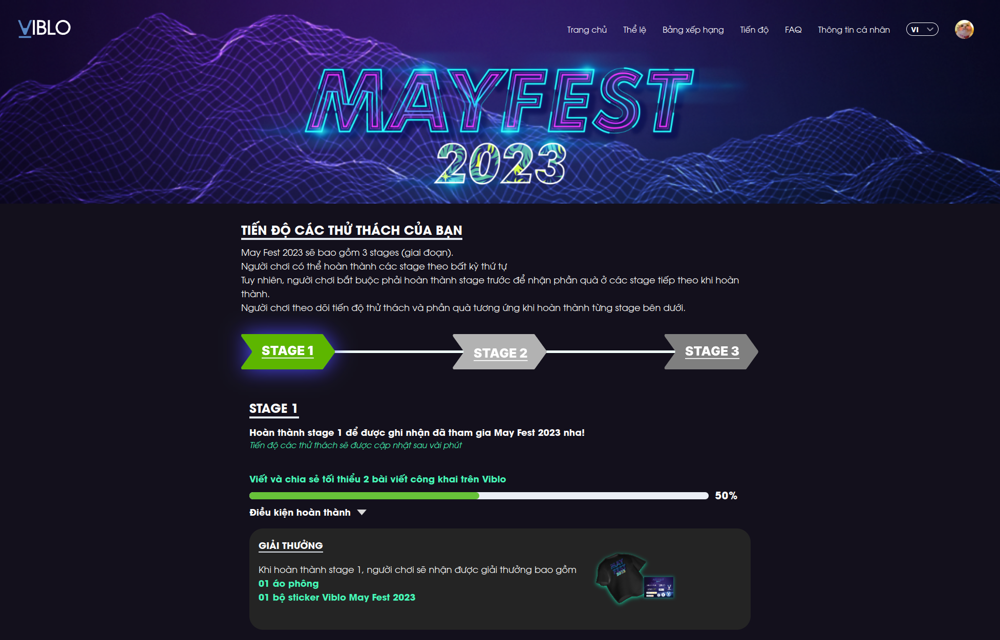
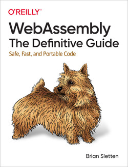

Nếu là người Việt hoặc đang sinh sống tại Việt Nam thì chắc các bạn cũng không lạ gì với đợt nghỉ tận 5 ngày vừa qua :v Tiếp thêm đó thì công ty mình khuyến khích nghỉ thêm 2 ngày nữa vì đợt này hình như cũng trùng với tuần lễ vàng hay đợt nghỉ gì đó bên Nhật, thế nên mình cũng đã định làm một số việc trong thời gian này cho đỡ phí. Bài viết này cứ coi như là một báo cáo mình tự viết vậy :)))

## Chơi bời các thứ

Mặc dù cũng muốn chơi game hết tận 9 ngày thật nhưng mà mình lại về nhà trong nửa đầu đợt nghỉ, tầm 5 ngày gì đó. Thế nên chủ yếu trong đợt này mình ngồi xem phim là chính. Được cái xem Netflix trên tivi màn hình lớn cũng thích hơn và cũng đỡ mỏi mắt nữa =))) Trong thời gian nghỉ thì mình có thời gian để xem hết đống phim/series này:

### Trốn thì ngại mà thôi cũng kệ - We Married as a Job

Phim đầu tiên mà mình xem, cũng chẳng hiểu sao Netflix lại đề xuất ra cái phim này dù mình hầu như không bảo giờ xem phim Nhật, trừ anime các thứ. Nội dung khá nhẹ nhàng và hài, cùng với đó là nó không bị lố như mấy cái phim của bên Nhật khác, đặc biệt là mấy phim chuyển thể. Xem xong thì mình khá thích chị đóng vai Mikuri =))) đáng yêu thực sự => +1 simp

### How to Get Rich

Ờ thì giải trí xong thì tất nhiên là phải làm giàu rồi. Series này có vẻ mới được Netflix ra mắt và mình xem bởi vì mình nghèo =)) Thật ra nội dung thì mình chưa xem hết nhưng mà mấy tập đầu cơ bản sẽ nói về mấy cái kiểu hạn chế tối đa việc nợ, tiêu linh tinh ít thôi, vân vân và mây mây. Nói chung nội dung khá ok, hi vọng là mình sẽ có thể xem hết series này không thì  mình sẽ lôi ra xem những lúc chuẩn bị mua đồ trên Shope.

### Nguồn gốc của hương vị - Flavorful Origins

Với người thích đồ ăn như mình thì một số phim tài liệu của Netflix khá ok để xem trong lúc làm gì đó mà không tập trung quá nhiều. Series này có tận 3 mùa cơ mà hiện tại mình mới xem xong phần Ẩm thực Cam Túc =))) Again thì mình sẽ cố gắng để xem hết toàn bộ series này.

### Và rồi cũng đến lúc: chơi game

Sau khi ở nhà 5 ngày thì mình cũng lên Hà Nội, cũng bởi vì mặc dù công ty khuyến khích nghỉ nhưng ai đ thích nghỉ thì vẫn có thể đi làm, cam kết output cho 2 ngày đó là được =))) Trở lại với cái máy bàn yêu quý thì tất nhiên việc đầu tiên mình làm sẽ là chơi game rồi. Bình thường mình sẽ ngồi chơi TFT (tiên sư Rito fresher code game cho Lux cast chiêu ngu không thể tả được) nhưng mà đợt này cũng khá chán nên mình chơi lại Oxygen Not Included. Nói chung là có vẻ càng ngày mình càng lười :))) TFT thì mỗi round cần check bài xếp bài các thứ còn Oxygen Not Included giờ chỉ cần vẽ task ra để mấy thằng đệ làm thôi.

## Học hành

À thì nếu nghỉ tận 9 ngày mà không học cái gì mới thì đúng là có lỗi thật. Đợt nghỉ này thì mình cũng cố gắng học thêm/đọc thêm một số thứ như sau:

### Machine Learning Compilation

Deploy mấy mô hình ML lên production sẽ cần một số điểm chú ý, vì trong khi phát triển chúng ta sẽ có một tỉ thứ dùng để debug được đặt kèm trong mà nguồn thì lúc deploy ta sẽ cần lược bỏ những thứ không cần thiết cũng như viết lại mã nguồn để biên dịch ML thành các dạng thực thi hiệu quả hơn.

Nội dung khóa này sẽ không có quá nhiều thứ để đề cập đến, chú yếu sẽ nói về những khái niệm cơ bản như tensor, primitive tensor function cũng như cách code chúng như thế nào. Trong suốt khóa học thì code demo sẽ được tạo bằng cách sử dụng thư viện TVM và đến cuối thì có giới thiệu về GPU cũng Hardware Acceleration nữa. Nói chung là mặc dù nội dung khá OK nhưng bạn đừng kì vọng là học xong khóa này ta sẽ có thể tự code lại các mô hình hiện có để nó nhanh hơn x2, x5, x10, nhất là khi việc biên dịch các mô hình ML để tối ưu quá trình chạy vẫn là nơi mà các ông lớn cạnh tranh.

### Viết Viblo

Ờ thì đợt này bên phía Viblo có sự kiện tháng 5, mà Viblo lại là sản phẩm của công ty mình nên việc tham gia là chuyện đương nhiên rồi. Để đạt được stage đầu thì mình cũng cố gắng viết được 2 bài về Airflow, còn các stage khác thì chịu rồi.

### Đọc sách và nghe seminar

Cũng may là mình không bị hoa mắt khi đọc quá nhiều chữ, thế nên đợt vừa rồi mình cũng cố đọc thêm cuốn **WebAssembly: The Definitive Guide** để cập nhật thêm công nghệ. Tiếp đó thì một group trên Facebook mà mình làm tàu ngầm có tên MLOpsVN cũng có chuỗi seminar khá là hay nên mình cũng ngồi xem lại đống record của mọi người.

## Tổng kết

Nói chung là trong đợt nghỉ lễ vừa qua, việc chơi bời của mình diễn ra khá tự nhiên trong khi học hành chỉ là bởi vì thấy hơi phí thời gian nên mới cố gắng học, thành ra nó hơi gượng ép. À ngoài ra thì mình cũng có đi gặp bạn bè các thứ nữa, có vẻ như ai cũng đang nghĩ đến việc lập gia đình rồi nên câu chuyện cũng bắt đầu về cơm áo gạo tiền, haiz. Thật ra mấy đợt nghỉ này mình cũng muốn đi chơi đâu đó, tuy nhiên tự đi thì lười mà đi du lịch thì lại đông (với cả thật ra là mình nghèo nên không có tiền đi nữa), thế nên mình cũng khá hài lòng về những gì đã làm trong đợt nghỉ này.
