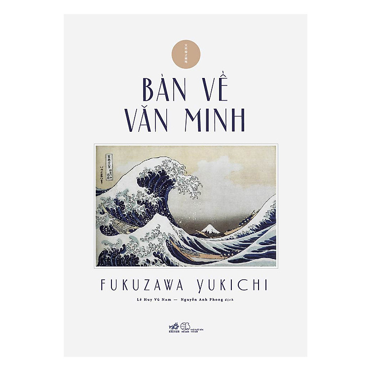
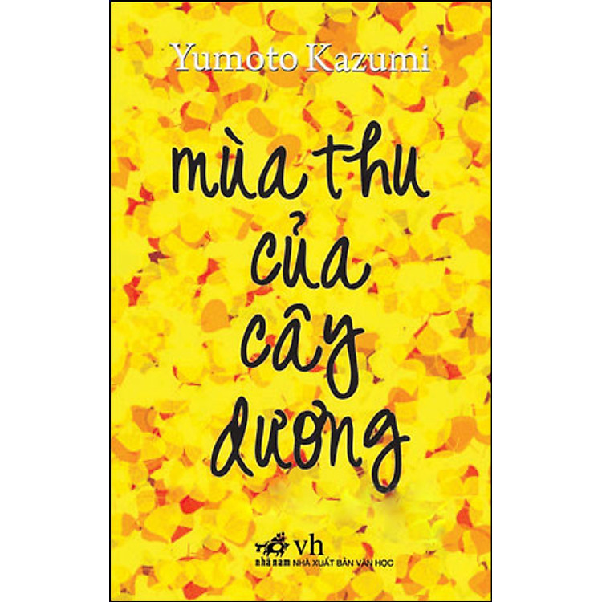
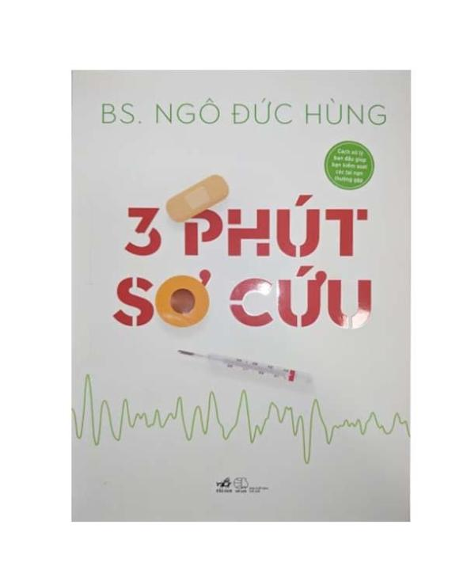
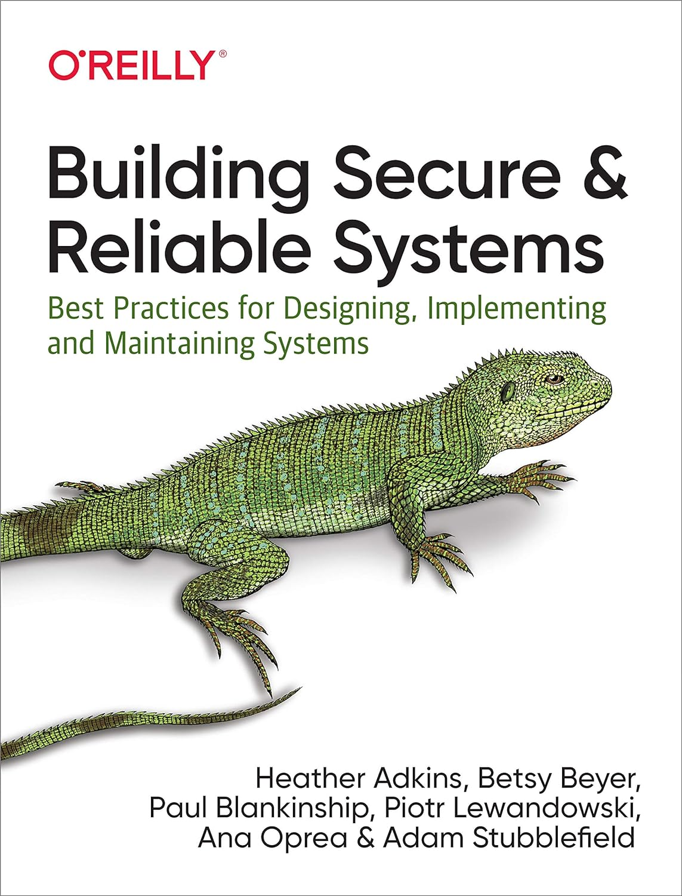
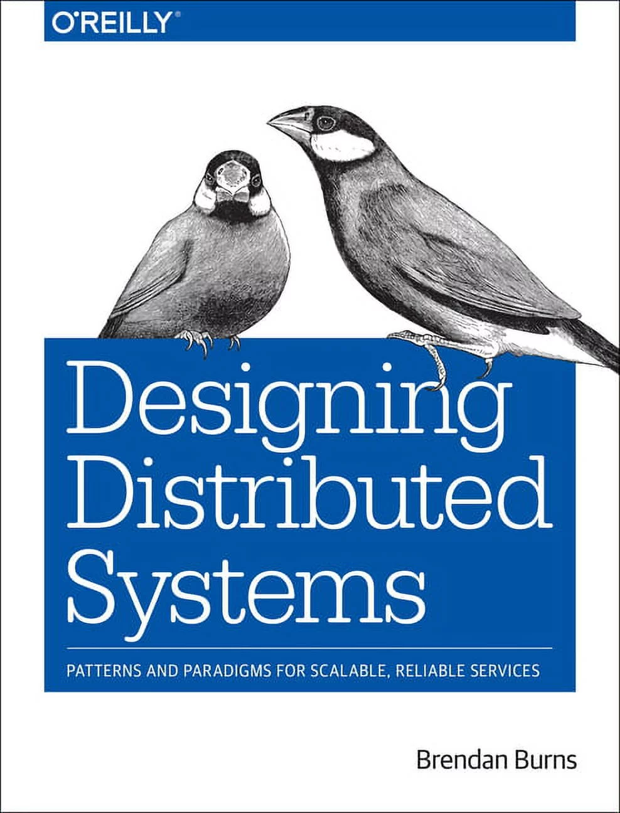
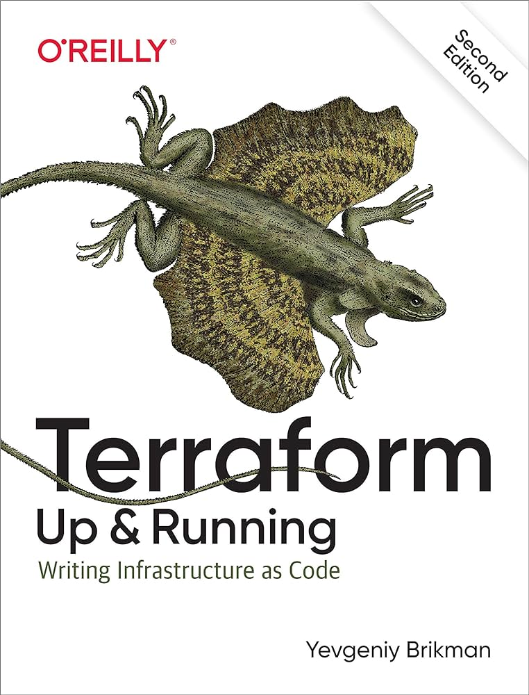
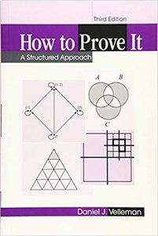
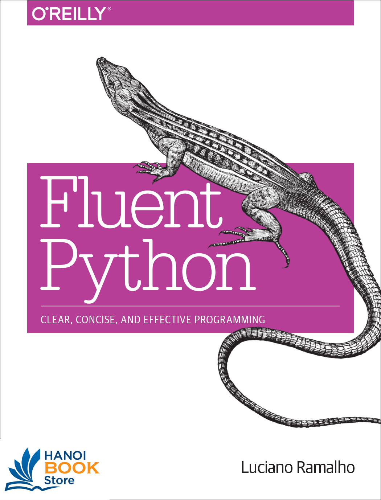
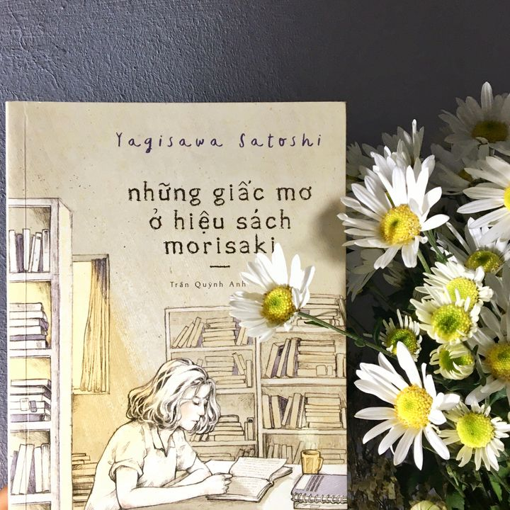

Những năm vừa rồi cũng khá rảnh nên mình đọc khá nhiều sách, mình thấy sẽ tốt hơn nếu có một chỗ để lưu lại xem bản thân đã đọc được nhưng cuốn gì, và do đó chúng ta có bài viết này.

## Bàn về văn minh - Fukuzawa Yukichi

“Bàn về văn minh” được coi là một trong những tác phẩm quan trọng nhất của Fukuzawa Yukichi, nhà tư tưởng, nhà giáo dục nổi tiếng Nhật Bản. Mang trong mình tính triết luận, Bàn về văn minh đã đặt ra hàng loạt các vấn đề xã hội, văn hoá, chính trị, kinh tế, đạo đức… và mở ra con đường để Nhật Bản, với tư cách một nước đang phát triển, kết nối với thế giới văn minh, tiến bộ.

## Mùa thu của cây dương

Mùa thu của cây dương được Kazumi Yumoto sáng tác vào năm 1997, câu chuyện viết về những nỗi băn khoăn, trăn trở của con người khi phải đối diện với sự sống và cái chết. Tại đây, họ bắt đầu hình thành những dấu hỏi lớn về bản thân lẫn nguồn gốc cuộc đời. Kazumi Yumoto đã khắc hoạ những nỗi lo lắng đó bằng giọng văn nhẹ nhàng, giúp độc giả chạm đến những tâm hồn còn vương vấn và quẩn quanh bên quá khứ. Đồng thời, bà cũng mở ra góc nhìn khác về cuộc sống, khích lệ mỗi cá nhân tiến bước giành lại hạnh phúc trọn vẹn.

## Điều kỳ diệu ở tạp hoá Namiya

Cuốn này mình đọc hồi năm hai hoặc năm ba gì đó, cái hồi mà vẫn còn khá nhiều thời gian rảnh để ngồi đọc sách.
Nội dung của nó cũng không quá phức tạp, chỉ là thông qua việc ba thanh niên trẻ lánh tạm trong một căn nhà hoang mà kể về những câu chuyện tưởng chừng không liên quan đến nhau. Tuy vậy thì với tài kể chuyên của Keigo, các mốc dấu thời gian và không gian khéo léo được thay đổi và chúng đã được tác giả xâu chuỗi thành một kế cấu chặt chẽ và tất nhiên đọc nó rất cuốn.

## 3 phút sơ cứu - BS. Ngô Đức Hùng

Nội dung của cuốn sách này trang bị cho mỗi người kiến thức tối cơ bản để biết cách xử lý ban đầu giúp kiểm soát các tình huống tai nạn cũng như bệnh tật thường gặp trong cộng đồng, với tiêu chí ngắn gọn – rõ ràng – an toàn – hiệu quả.

## Building Secure and Reliable Systems

"Một hệ thống có thể được coi là thực sự đáng tin cậy nếu nó không an toàn về cơ bản? Hoặc chúng có thể được coi là an toàn không khi nếu chúng không đáng tin cậy? Bảo mật là yếu tố quan trọng đối với việc thiết kế và vận hành các hệ thống có thể mở rộng trong sản xuất, vì nó đóng một phần quan trọng trong chất lượng, hiệu suất và tính khả dụng của sản phẩm. Trong cuốn sách này, các chuyên gia từ Google chia sẻ các phương pháp hay nhất để giúp tổ chức của bạn thiết kế các hệ thống có thể mở rộng và đáng tin cậy về cơ bản là an toàn.

Building Secure and Reliable Systems là một trong bộ ba cuốn sách được giới thiệu tại <https://sre.google/books/>, nơi mà các chuyên gia từ Google chia sẻ các best practice để giúp ta thiết kế các hệ thống có thể mở rộng và đáng tin cậy và tất nhiên là cả an toàn.

## Designing Distributed Systems: Patterns and Paradigms for Scalable, Reliable Services

Designing Distributed Systems được viết bởi Brendan Burns (Co-Founder tại Kubernetes) nhằm cung cấp các pattern thường được sử dụng để triển khai các hệ thống phân tán cũng như các ví dụ được về chúng được triển khai bằng Kubernetes. Mặc dù được cho rằng cuốn sách nên được đặt tên lại là "Sử dụng Kubernetes: mở rộng ứng dụng web" khi mà một số review trên Amazon cũng không được tích cực cho lắm nhưng đây vẫn là tài liệu tốt khi tìm hiểu về các hệ thống phân tán.

## Terraform: Up & Running

Terraform đã trở thành công cụ không thể thiếu trong quá trình định nghĩa, khởi chạy và quản lý cơ sở hạ tầng dưới dạng mã (IaC - infrastructure as code) trên nhiều nền tảng đám mây và ảo hóa, bao gồm AWS, Google Cloud, Azure, v.v. Cuốn sách này giới thiệu sơ lược về Terraform cũng như cung cấp các ví dụ mã ngắn gọn, dễ khai báo của Terraform để triển khai và quản lý cơ sở hạ tầng chỉ bằng một vài lệnh đơn giản.

## HOW TO PROVE IT: A Structured Approach

Việc chứng minh một điều gì đó đôi khi sẽ không dễ dàng một chút nào nhất là các vấn đề liên quan đến khoa học. Cuốn sách này được viết nhằm giới thiệu các kỹ thuật cần thiết để đọc và viết chứng minh thông qua việc bắt đầu với các khái niệm cơ bản của logic và lý thuyết tập hợp, để học sinh làm quen với ngôn ngữ toán học và cách nó được giải thích và từ đó chỉ ra cách thức các phép chứng minh phức tạp được xây dựng từ các bước nhỏ hơn này.

## Fluent Python

Python là một ngôn ngữ dễ sử dụng nhưng để sử dụng tốt nó thì lại không đơn giản đến vậy. Fluent Python sẽ không giới thiệu lại các khái niệm cơ bản mà sẽ kỳ vọng hơn vào việc giúp  ta viết các đoạn mã, ngắn hơn, dễ đọc hơn, idiomatic hơn và hiệu quả hơn thông qua tận dụng các tính năng tốt nhất, hiểu rõ các concept của Python và các core-libraries của ngôn ngữ này.

## Những Giấc Mơ Ở Hiệu Sách Morisaki

Những giấc mơ ở hiệu sách Morisaki là đứa con tinh thần đầu tiên của nhà văn Satoshi Yagisawa. Cuốn sách tập trung vào hành trình của nhân vật chính Tatako và những trải nghiệm của cô trước và sau khi đến với khu phố sách cũ ở Jimbocho. Sau một vài biến cố không mong muốn, Tatako quay về hiệu sách của người cậu để ở ẩn một thời gian. Ban đầu, thái độ của Tatako đối với cửa hàng sách chỉ đơn thuần là một loại trách nhiệm, nhưng sau khi đọc thử một cuốn sách chỉ để giết thời gian, cô nhận ra rằng sách có thể khiến con người đồng cảm, cũng có thể giúp con người dường như bừng tỉnh khỏi những đám mây đen của cảm xúc. Từ sau ấy, chính nhờ việc thay đổi thái độ với những cuốn sách cũ, Tatako đã mở lòng hơn với những người xung quanh. Có lẽ, sách không chỉ mang lại nguồn tri thức, nguồn cảm xúc, mà nó còn kéo con người lại gần nhau. Và có lẽ chính từ bước ngoặt ấy, trái tim Tatako đã dần trở nên bình yên từ lúc nào không hay.
