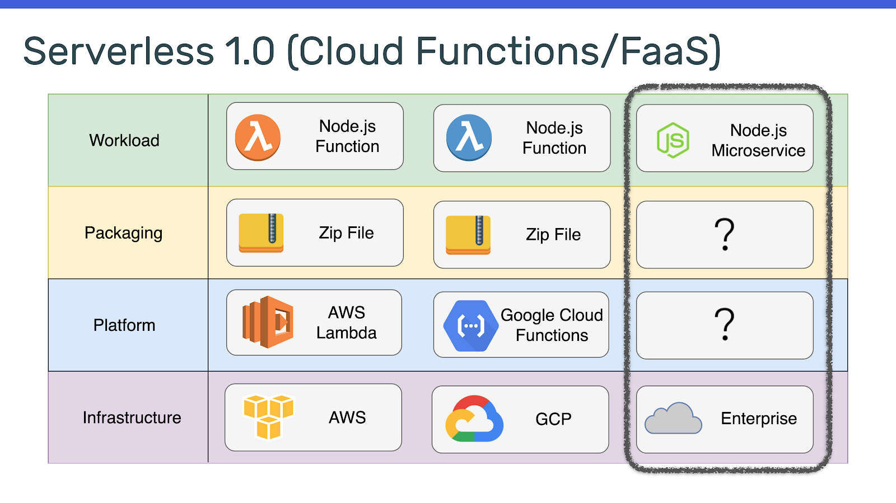
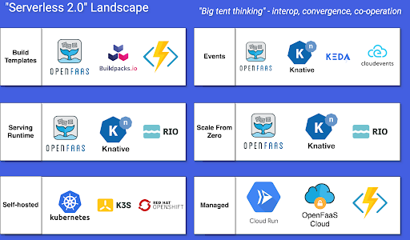

Bây giờ bạn đã có định nghĩa ban đầu về serverless và hai quan điểm chính về cách nó nên được xây dựng và hoạt động , hãy cùng khám phá những gì CNCF cung cấp cho hệ sinh thái Serverless. Chúng tôi sẽ so sánh các dự án mã nguồn mở khác nhau và tìm hiểu cách chúng hướng tới để tránh bị khóa vào bất kỳ nhà cung cấp nào.

Đến cuối chương này, bạn nên biết:

- Những sáng kiến ​​nào tồn tại trong CNCF xung quanh Serverless.
- Cách cơ bản Serverless được thực hiện trên Kubernetes.
- Định nghĩa Serverless 2.0.
- Tổng quan cấp cao về các khung mã nguồn mở Serverless 2.0 hàng đầu.

## Hiện trang của Serverless trong Kubernetes

Khi nói về Serverless trong phạm vi Kubernetes, bối cảnh CNCF Serverless phân tách chúng thành các dịch vụ có thể được “cài đặt” và vận hành trên một cụm và các dịch vụ được lưu trữ dưới dạng sản phẩm SaaS.

Phần khởi đầu nhỏ nhất cho workload trong Kubernetes là Pod, có thể được tạo thành từ một hoặc nhiều containers - chẳng hạn như workload chính và sau đó là một trình trợ giúp như proxy hoặc trình thu thập log. Pod tải mã và user-space từ container image được lưu trữ trong container registry.

Để truy cập các Pod trong một cụm, các nguyên tắc mạng Kubernetes khác nhau sẽ hoạt động, chẳng hạn như Service, LoadBalancer và Ingress. Mỗi cách này cung cấp một số cách hơi khác nhau để gửi lưu lượng đến workload đang chạy.

Các yếu tố cơ bản của ta đối với Serverless trên Kubernetes là:

- Một container image với mã chức năng hoặc tệp thực thi bên trong.
- Một registry để lưu trữ hình ảnh vùng chứa.
- Một Pod để chạy container image.
- Service truy cập Pod.

Thông thường, các dự án sẽ thêm nhiều thành phần khác ở trên cùng của stack này, chẳng hạn như giao diện người dùng và cAPI gateway, Ingress automation, auto-scaling, APIs và nhiều thành phần khác.

Các dự án xây dựng trên các nguyên tắc trên có mức độ tương thích tương đối tốt; ví dụ: workloads được xây dựng cho OpenFaaS và chạy trên Knative và ngược lại.

## Serverless 1.0 và Serverless 2.0

Trong thế giới Serverless 1.0, các nhà cung cấp đám mây đã tạo ra các sản phẩm độc lập mà không cần quan tâm đến tính di động hoặc di chuyển giữa các sản phẩm. Thông thường, việc chuyển từ AWS Lambda sang Azure Functions sẽ liên quan đến việc làm lại chữ ký, cách tạo tệp zip, cách truy cập các dịch vụ được quản lý và xử lý các vùng khả dụng khác nhau, khu vực và giới hạn cứng như RAM và kích thước function image.

Đối với một số khách hàng trong doanh nghiệp, việc giới hạn hình ảnh chức năng 256mb, thời lượng cuộc gọi tối đa 5 phút và dung lượng RAM tối đa là 2GB là quá hạn chế so với nhu cầu của họ. Hơn nữa, Serverless 1.0 không cung cấp câu trả lời cho các dịch vụ nhỏ mà nhiều công ty có.

Workload của Serverless 2.0 linh hoạt hơn nhiều so với 1.0. Định nghĩa Serverless 2.0 như sau:

- Được lưu trữ trong container image tương thích OCI.
- Hiển thị một máy chủ HTTP trên cổng 8080.
- Có thể được cấu hình với các biến môi trường.

Định nghĩa tương đối ngắn gọn này là thứ cho phép mã được viết bằng Node.js, Go, Python hoặc bất kỳ tệp nhị phân nào khác được di chuyển giữa các nền tảng FaaS một cách dễ dàng. Serverless 2.0 là thứ làm cho các chức năng của OpenFaaS trở nên linh hoạt. Có thêm lợi ích là có thể chạy các dịch vụ nhỏ - chẳng hạn như Ruby on Rails, Express.js, Vert.x và Micronaut.

## Bức tranh chung về Serverless 2.0

Các framework này tuân theo định nghĩa Serverless 2.0 và có sức hút nhất trong phân đoạn Serverless của CNCF Landscape. Một số dự án được tạo ra một cách hữu cơ bởi các nhà phát triển độc lập, trong khi những dự án khác là nỗ lực của các công ty phần mềm thương mại.

Bức tranh chung này được chia nhỏ hơn nữa thành các khả năng được cung cấp. Vì vậy, chẳng hạn, OpenFaaS và Knative cung cấp chức năng trong hầu hết các hộp, trong khi Buildpacks, CloudEvents và Keda chỉ dành riêng cho một số danh mục nhất định và dựa vào các dự án khác để lấp đầy khoảng trống.

## Các nền tảng Serverless

### OpenFaaS

[OpenFaaS](https://github.com/openfaas/faas) được tạo ra để các nhà phát triển có thể sử dụng phần cứng của riêng họ để chạy các chức năng bằng các Docker containers. Nó có hơn 22k stars trên GitHub và một cộng đồng lớn gồm các nhà phát triển phần mềm độc lập và người dùng cuối như BT, Citrix, LivePerson và Vision Banco:

- **Build templates**: OpenFaaS cung cấp bộ mẫu xây dựng riêng có thể được sử dụng để tạo các hàm. Các mẫu cũng có thể được khám phá và chia sẻ trực tuyến thông qua Template Store.

- **Serving runtime**: OpenFaaS là serving runtime trưởng thành nhất và có nhiều sao nhất trên toàn cảnh. Nó hỗ trợ tự động mở rộng quy mô với Prometheus hoặc Kubernetes HPAv2. Nó có thể scale to zero và quay lại một lần nữa để tiết kiệm tài nguyên. Runtime phân phối đi kèm với REST API, CLI và UI. OpenFaaS có hỗ trợ chuyển đổi lưu lượng với Istio hoặc Linkerd2. OpenFaaS tuân theo định nghĩa Serverless 2.0.

- **Events**: OpenFaaS có một số trình kích hoạt sự kiện, bao gồm Apache Kafka, NATS, AWS SQS, Cron, MQTT và các trình kích hoạt khác. Một trình kết nối-sdk được tạo sẵn cho Golang để các trình kết nối mới có thể được viết trong một khoảng thời gian ngắn.

- **Scale from Zero**: Thu phóng đến và từ 0 được hỗ trợ

- **Managed**: OpenFaaS Cloud là một dịch vụ được quản lý được xây dựng trực tiếp trên OpenFaaS, cung cấp hỗ trợ nhiều người dùng, bảng điều khiển, chỉ số phong phú và tích hợp với GitHub / GitLab. OpenFaaS Cloud là mã nguồn mở và có thể được lưu trữ.

### Knative

Ban đầu được phát triển tại Google, [Knative](https://github.com/knative/serving) hiện có các cộng tác viên từ IBM, RedHat và VMware. Phạm vi của Knative khi ra mắt bao gồm: events, build và serving. Kể từ khi ra mắt, dự án build đã không còn được sử dụng và được thay thế bởi dự án Tekton độc lập để tạo các build và CI pipelines:

- **Build templates**: Knative không có bộ mẫu riêng, nhưng có thể sử dụng OpenFaaS hoặc Buildpacks. Hầu hết người dùng duy trì Dockerfiles và mã boiler-plate của riêng họ. Knative tuân theo định nghĩa Serverless 2.0.

- **Serving runtime**: Thời gian chạy phục vụ của Knative được gọi là “Knative serve” và yêu cầu một cổng API riêng biệt như Ambassador, Istio hoặc Gloo để hoạt động. Knative thường được cài đặt cùng với Istio để cung cấp dịch chuyển lưu lượng truy cập. Mỗi lần triển khai dịch vụ là không thay đổi và nội bộ tạo một bản sửa đổi cho phép người dùng quay lại phiên bản mã trước đó.

- **Events**: Dự án tổ chức sự kiện Knative bao gồm tất cả các tích hợp với các event. Có một tập hợp 4-5 nguyên thủy được yêu cầu để nhận các sự kiện từ một broker. Khi đúng vị trí, các function có thể được kích hoạt từ nhiều nguồn sự kiện khác nhau.

- **Scale from Zero**: Knative có hỗ trợ thu phóng đến và từ 0. Cold-start time là cao đáng kể; tuy nhiên, dự án đang tích cực cố gắng tìm cách giảm độ trễ.

### Google Cloud Run

[Google Cloud Run](https://cloud.google.com/run) thực sự không phải là một nền tảng có thể cài đặt và, không giống như các nền tảng khác được liệt kê, nó không phải là mã nguồn mở, nhưng nó tuân theo định nghĩa Serverless 2.0. Điều này cung cấp sự cân bằng giữa. Bạn có thể xây dựng vùng chứa cho OpenFaaS hoặc Knative và sau đó triển khai nó lên Cloud Run. Nền tảng này được lập hóa đơn như một SaaS và có một số giới hạn nhất định (kể từ tháng 6 năm 2020, không thể sử dụng quá 2GB RAM và thời gian thực thi được giới hạn trong 15 phút).

### KEDA

[KEDA](https://github.com/kedacore/keda) chủ yếu quan tâm đến các hàm gọi từ các event và sử dụng các mẫu xây dựng Hàm Azure để xác định các hàm. Vào ngày 31 tháng 3 năm 2020, KEDA đã được tài trợ cho CNCF như một dự án Sandbox. Bạn có thể đọc thêm về nó trong một số bài viết blog.

Liên quan mật thiết đến KEDA là Azure Functions, cung cấp nền tảng triển khai kiểu serverless 1.0 được lưu trữ trên đám mây.

### Rio

[Rio](https://github.com/rancher/rio) nhằm mục đích cung cấp PaaS trọng lượng nhẹ, theo kiểu serverless. Ban đầu được xây dựng bởi Rancher như một nhánh của Knative, dự án đã phát triển để xây dựng lại một số khái niệm Knative theo cách riêng của nó, chẳng hạn như các bản sửa đổi và dịch vụ mà không phụ thuộc nhiều vào dự án thượng nguồn.

Rio là dự án duy nhất khác trong bối cảnh Serverless 2.0 có giao diện người dùng chính thức của riêng nó. Rio hiện đang trong giai đoạn thử nghiệm.

### CloudEvents

là đặc tả kỹ thuật được viết bởi một số người tham gia trong CNCF’s Serverless Working Group. Trong khi định nghĩa Serverless 2.0 cho phép các chức năng di động giữa các đám mây, dữ liệu vẫn khó trích xuất. Dự án CloudEvents có các đại diện từ AWS, Oracle, Azure và Google và nhằm mục đích làm cho dữ liệu từ các dự án SaaS như cơ sở dữ liệu và kho lưu trữ đối tượng dễ sử dụng hơn trên bất kỳ đám mây nào khác. Phần mềm bao gồm: một SDK có thể được sử dụng trong một số ngôn ngữ lập trình khác nhau cùng với đặc điểm kỹ thuật cho định dạng sự kiện hiện đang ở v1.0. CloudEvents cũng là một dự án sandbox của CNCF.

## CNCF Serverless Working Group

The [Serverless Working Group](https://github.com/cncf/wg-serverless) đã được CNCF thành lập  vào năm 2017 dành cho những người quan tâm đặc biệt đến Serverless và FaaS. Kết quả thu được đầu tiên của nó là một phần lớn phân tích nhằm xác định các thuật ngữ Serverless và FaaS, và một bản thảo đặc tả đã được xuất bản. Ngay sau đó, CloudEvents đã được khởi động và nhanh chóng đạt được phiên bản 1.0 ổn định cùng với việc được tặng cho CNCF như một dự án sandbox. Nhóm làm việc cũng đang khám phá các chủ đề liên quan khác, chẳng hạn như chuỗi chức năng và quy trình làm việc.
