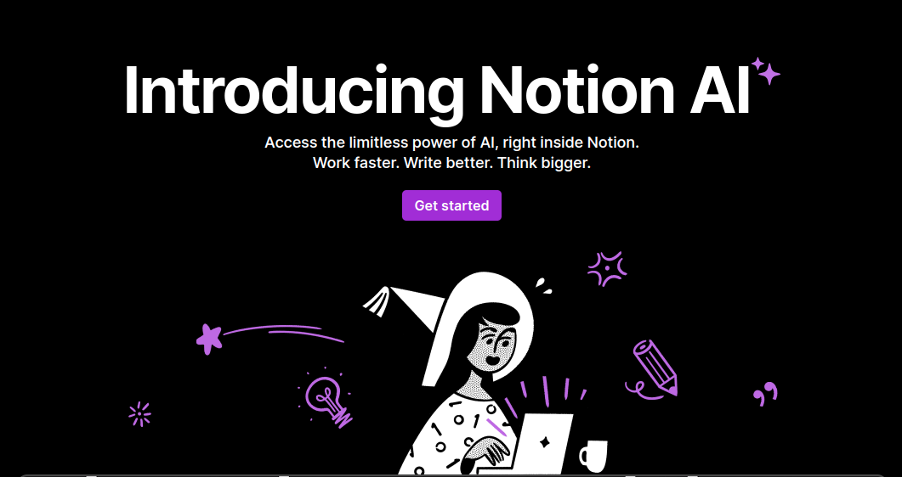
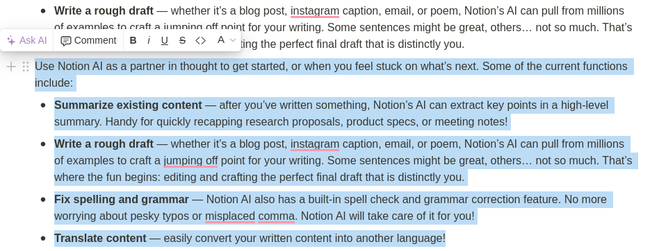
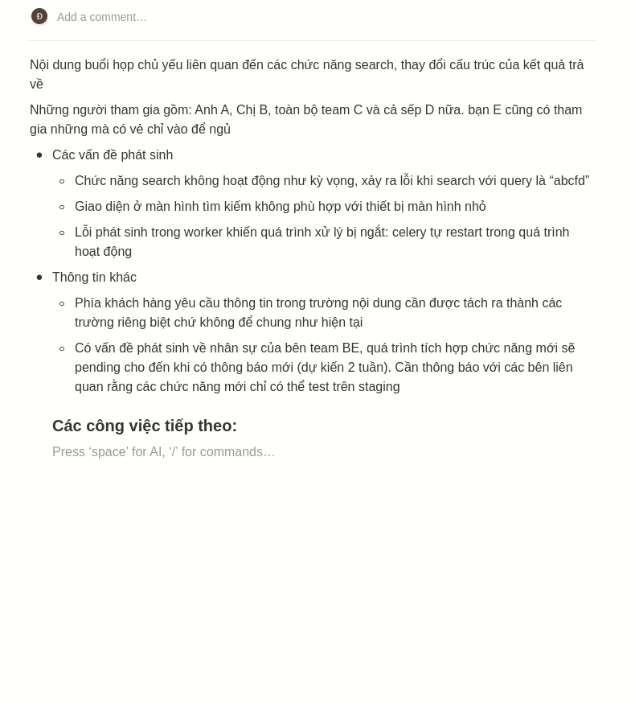
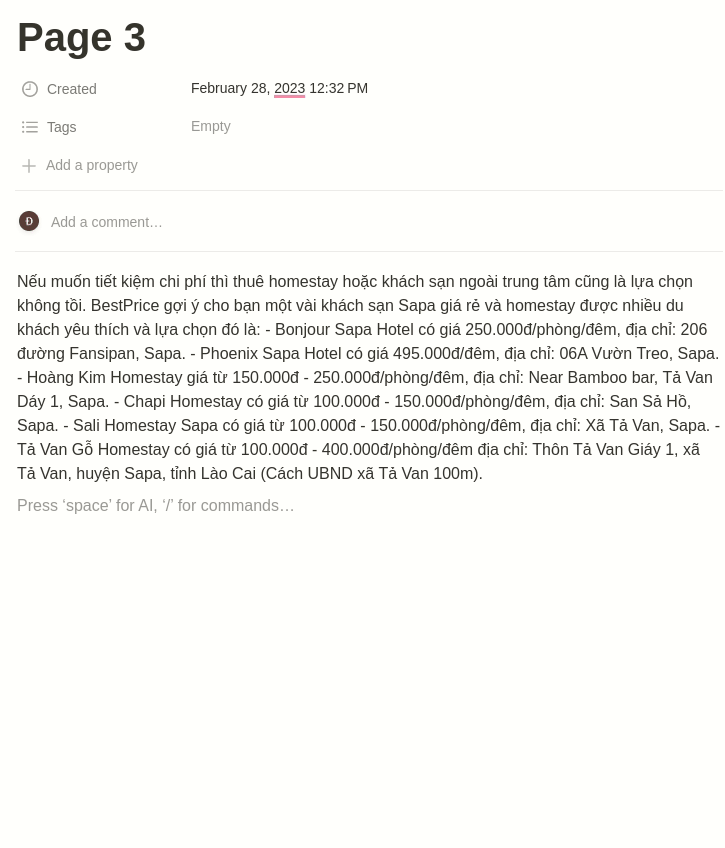
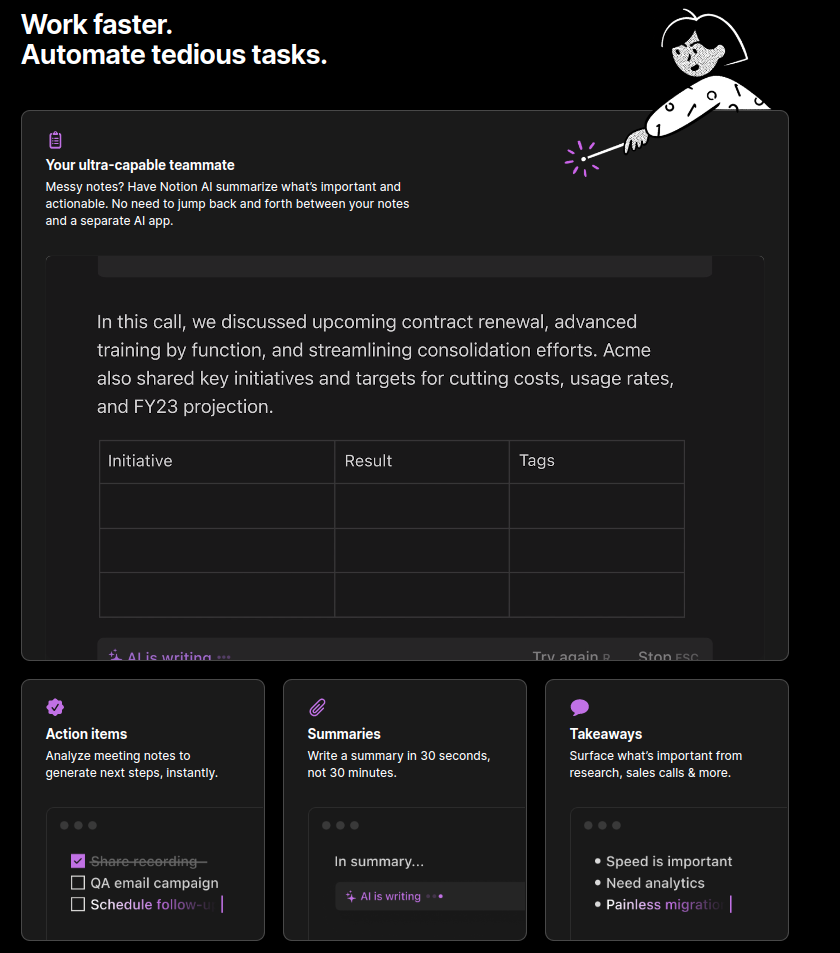
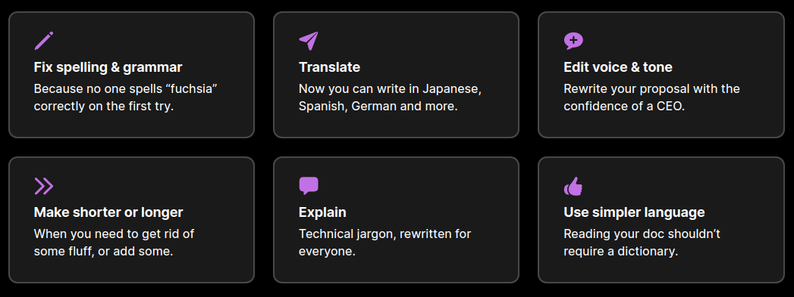
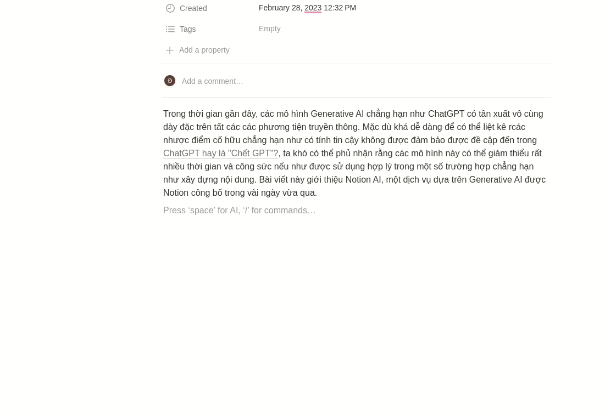
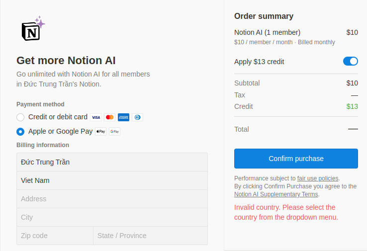

Trong thời gian gần đây, các mô hình Generative AI chẳng hạn như ChatGPT có tần xuất vô cùng dày đặc trên tất các các phương tiện truyền thông. Mặc dù khá dễ dàng để có thể liệt kê các nhược điểm cố hữu chẳng hạn như có tính tin cậy không được đảm bảo được đề cập đến trong [ChatGPT hay là "Chết GPT"?](https://viblo.asia/p/chatgpt-hay-la-chet-gpt-7ymJXXKWJkq), ta khó có thể phủ nhận rằng các mô hình này có thể giảm thiểu rất nhiều thời gian và công sức nếu như được sử dụng hợp lý trong một số trường hợp chẳng hạn như xây dựng nội dung. Bài viết này giới thiệu Notion AI, một dịch vụ dựa trên Generative AI được Notion công bố trong vài ngày vừa qua.


# Notion AI là gì?

Notion AI là một dịch vụ của Notion sử dụng mô hình Generative AI để tạo ra các đoạn văn bản tự động. Với Notion AI, người dùng có thể tạo ra các nội dung đa dạng, từ blog, báo cáo cho đến các tài liệu kinh doanh một cách nhanh chóng và dễ dàng hơn.



Đây hiện tại đang là một dịch vụ đang cho phép dùng thử miễn phí của Notion. Notion AI có thể được sử dụng để tạo ra các bài viết blog, báo cáo và tài liệu kinh doanh với tốc độ nhanh hơn và tiết kiệm thời gian so với việc viết bằng tay. Nó cũng có thể hỗ trợ trong việc tạo ra các nội dung theo chủ đề hoặc phong cách cụ thể, giúp người dùng tập trung vào việc sáng tạo ý tưởng hơn là việc viết nội dung chi tiết. Tuy nhiên, cần lưu ý rằng Notion AI vẫn cần được biên tập và chỉnh sửa để đảm bảo tính chính xác và độ tin cậy của nội dung (cái đoạn mình gạch ở trên là chỉnh do Notion AI sinh ra, thế nên có thể nói rằng ta cũng khó có thể tin tưởng vào nội dung mà dịch vụ này tạo). Thông tin chi tiết mọi người có thể tham khảo tại [Introducing Notion AI](https://www.notion.so/product/ai)

Notion AI được đặt chung trong toolbar, nơi ta có thể tìm thấy các chức năng chỉnh sửa nội dung, vậy nên ta sẽ không gặp quá nhiều khó khăn khi làm quen với công cụ mới này.


# Notion AI có thể làm những gì?

Theo mình nghĩ, các chức năng chính Notion AI sẽ xoay quanh việc giảm thiểu tối đa những công việc *tẻ nhạt*, cải thiện chất lượng các bài viết cũng như hỗ trợ quá trình lên ý tưởng cho bất kỳ nội dung nào mà bạn sắp triển khai. Dựa vào đây, mình nghĩ ta có thể chia các chức năng của Notion AI thành hai nhóm như sau:

## Chức năng liên quan đến ghi chú

Notion hỗ trợ vô cùng tốt việc sắp xếp lại các ghi chú thành các dạng dễ dàng nắm bắt hơn chẳng hạn như bảng biểu, todo list, ... Để có thể hình dung dễ dàng hơn, ta có thể tham khảo đoạn note sau:

```bash
- Các vấn đề phát sinh
    - Chức năng search không hoạt động như kỳ vọng, xảu ra lỗi khi search với query là “abcfd”
    - Giao diện ở màn hình tìm kiếm không phù hợp với thiết bị màn hình nhỏ
    - Lỗi phát sinh trong worker khiến quá trình xử lý bị ngắt: celery tự restart trong quá trình hoạt động
- Thông tin khác
    - Phía khách hàng yêu cầu thông tin trong trường nội dung cần được tách ra thành các trường riêng biệt chứ không để chung như hiện tại
    - Có vấn đề phát sinh về nhân sự của bên team BE, quá trình tích hợp chức năng mới sẽ pending cho đến khi có thông báo mới (dự kiến 2 tuần), các chức năng mới chỉ có thể test trên staging
```

Thông thường mỗi khi note xong một đống thông tin như trên, ta sẽ cần làm thủ công việc xác định những action cần thực hiện để tạo một todo list và quá trình này nhanh thì cũng mất vài phút =)) Giờ đây với sự giúp sức của Notion AI, ta có thể dễ dàng tạo todo list chỉ với vài thao tác như sau:



Có thể thấy rằng chỉ với vài bước thao tác. Notion đã tự sinh cho ta danh sách công việc cần thực hiện, thứ mà sẽ phải tốn khá nhiều công sức để copy/paste nếu ta thực hiện thủ công. Không chỉ vậy, notion còn hỗ trợ các chức năng khác, chẳng hạn tạo bảng biểu từ một đoạn text chẳng hạn như sau:



Như trong hình trên, ta có thể thấy rằng Notion có thể dễ dàng bóc tách thông tin từ đoạn văn, thể hiện thành dạng bảng và tóm tắt thành nội dung chính từ toàn bộ nội dung trên. Ta có thể dễ dang thấy rằng, nội dung được Notion sinh ra hoàn toàn chứa những thông tin được đề cập trong đoạn text gốc nhưng lại giúp người đọc có thể dễ dàng tiếp cận hơn rất nhiều. 

Bên cạnh đó, Notion còn hỗ trợ các chức năng khác, chẳng hạn như tóm tắt ý chính (**take aways**) như được liệt kê trên Landing page. Mọi người nếu có thời gian rảnh thì có thể sử dụng thử xem sao nhé.



## Chức năng liên quan đến tạo/cải thiện bài viết

Bên cạnh các chức năng liên quan đến quá trình thao tác với ghi chú, Notion AI còn có thể là trợ thủ đắc lực trong xuyên suốt quá trình sáng tạo nội dung, từ lúc lên ý tưởng, triển khai khung ý chính và hoàn thiện toàn bộ bài viết, cụ thể như sau:

### Brainstoming

Không phải lúc nào chúng ta cũng có ý tưởng cụ thể về chủ đề sẽ viết, nhất là khi phải viết theo kiểu công nghiệp nhằm đủ KPI hoặc phải đi seeding nhằm giải quyết vấn đề miếng cơm manh áo. Trong những tình huống như vậy, chức năng brainstoming của Notion sẽ là cứu tinh của chúng ta khi khi nó sẽ đưa ra nhanh chóng hơn 10 ý tưởng xoay quanh chủ đề đầu vào, thứ ta không thể thu được sau những họp nhóm mà tất cả các thành viên chỉ nhìn nhau và cười.


Đây là bạn còn giữ lại chút lương tâm của nghề gõ chữ chứ nếu như quá lười viết thì Notion có thể tự viết các bài viết đủ dài để ta seeding về vấn đề gì đó, tuy nhiên tôi nghĩ ta nên hạn chế dùng chức năng này vì sẽ chẳng ai muốn đọc những bài viết vô thưởng vô phạt như vậy cả.


### Dựng outline

Sau khi chọn được chủ đề từ các gợi ý của Notion, ta sẽ chuyển đến bước là dựng khung nội dung. Tiếp đó nếu như quá lười, bạn có thể sử dụng tiếp chức năng của Notion như nhau:


Có lưu ý một xíu Notion sẽ sinh outline theo cấu trúc thông thường vậy nên sẽ ta sẽ khó thu được outline chứa đủ những mục nội dung mà như mong muốn nếu chủ đề được chọn quá đặc thù cũng như việc cố gắng viết theo một khung có trước cũng có thể khiến cho việc triển khai nội dung gặp một chút khó khăn.

### Triển khai nội dung
Sau khi có outline, công đoạn cuối cùng để ta có thể có được một bài viết hoàn chỉnh là hoàn thiện chi tiết các mục đã tạo. Trong quá trình này, notion hỗ trợ chúng ta sửa lỗi chính tả và ngữ pháp, dịch nội dung sang ngôn ngữ thứ hai, điều chỉnh cách hành văn để phù hợp với bối cảnh hoặc chỉ đơn giản là thêm các đoạn giải thích hoặc viết lại theo ngôn ngữ dễ hiểu hơn để người đọc có thể dễ dàng tiếp thu thông tin mà không cần sử dụng thêm nguồn tài liệu thứ ba.



Tạm bỏ qua các chức năng liên quan đến dịch thuật hoặc sửa lỗi ngữ pháp/chính tả, mình khá ấn tượng với việc Notion hỗ trợ việc điều chỉnh câu từ sang lối hành văn thích hợp mà không làm mất đi nội dung chính của đoạn văn đầu vào. Chẳng hạn như ví dụ dưới đây, Notion đã viết lại giúp mình đoạn mở đầu của bài viết này và công nhận thực sự rằng nó nghe xuôi tai hơn rất nhiều khi so với bản gốc =))))



Khá là may mắn vì Notion hỗ trợ rất nhiều ngôn ngữ và trong đó có cả tiếng Việt. Mình sẽ có nhiều cách sử dụng Notion AI để cải thiện lối hành văn cho bản thân nữa. Trong quá trình sử dụng nếu có cách sử dụng nào hay thì mọi người hãy comment phía dưới nhé =)))

# Tổng kết

Chỉ mới được giới thiệu trong vòng một tuần trước nhưng có vẻ như Notion AI đang làm tốt những thứ mà ta kỳ vọng về một hệ thống **nâng cao tri tuệ của con người chứ không phải thay thế nó**. Không giống như ChatGPT với sự hình tượng toàn năng và những câu chém gió xuất thần mà nó đưa ra, Notion AI là tập hợp nhưng công cụ hữu ích được tích hợp sâu trong trình soạn thảo của Notion giúp ta hoàn thành tài liệu nhanh nhất có thể. Cá nhận mình thấy rằng Notion AI như hoạt động như một trợ lý nhỏ bé luôn bên cạnh ta trong các công việc hàng ngày, ngay tại nơi ta làm việc, luôn sẵn sàng giải quyết giúp ta giải quyết các công việc nhỏ nhặt để ta có thể dành tối đa thời gian cho quá trình học tập/làm việc của bản thân. Và tất nhiên để duy trì một hệ thống tốt như vậy, Notion không thể cung cấp miễn phí và không giới hạn chức năng này cho tất cả người dùng. Hiện tại Notion đang thu phí 10$ mỗi tháng để người dùng có thể sử dụng các chức năng liên quan đến AI và trước khi đăng ký subscription, Notion cho sử dụng tối đa 20 lượt miễn phí cho đến ngày 5 tháng 4 năm 2023.



Có thể thấy rằng bài viết này đang seeding cho Notion :)) Ừ thì có khi thế thật, lúc tôi nhấn đăng ký subscription thì không hiểu sao tài khoản đã có sẵn 13$, giống như Notion biết trước tôi sẽ viết bài seeding này nên đã chuyển trước tiền công vậy :v . Nói tóm tại thì Notion AI vẫn đáng để sử dụng thử nhất là các bạn hay hoạt động nhiều trong lĩnh vực viết lách. Bài viết này đến đây là hết, cảm ơn mọi người đã dành thời gian đọc.