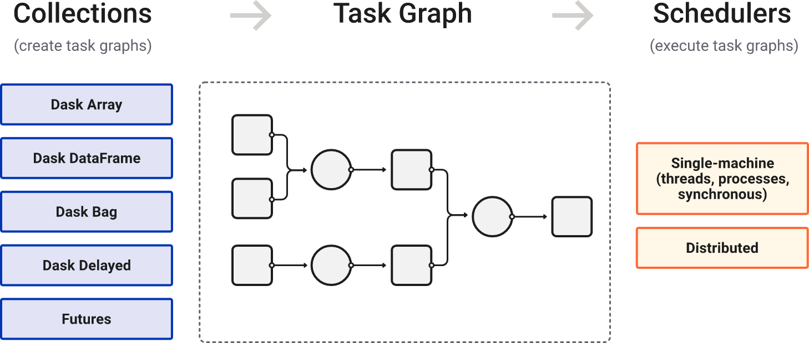
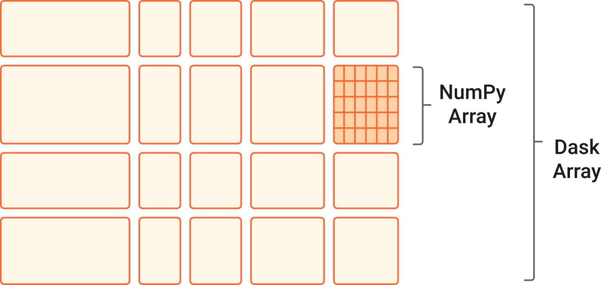
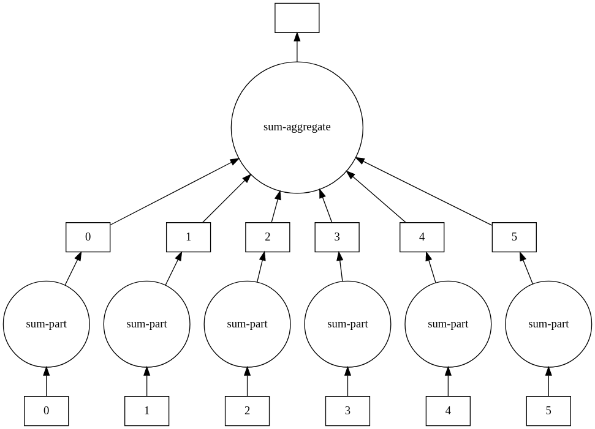
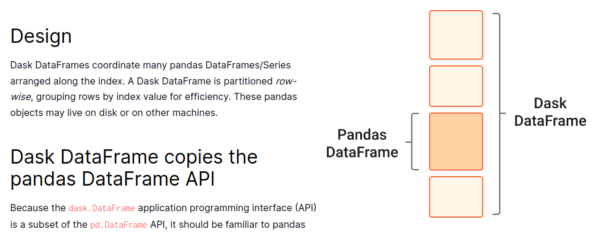
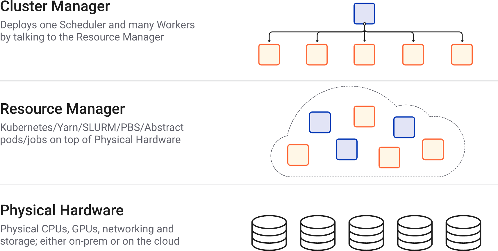
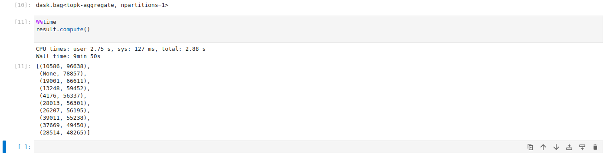
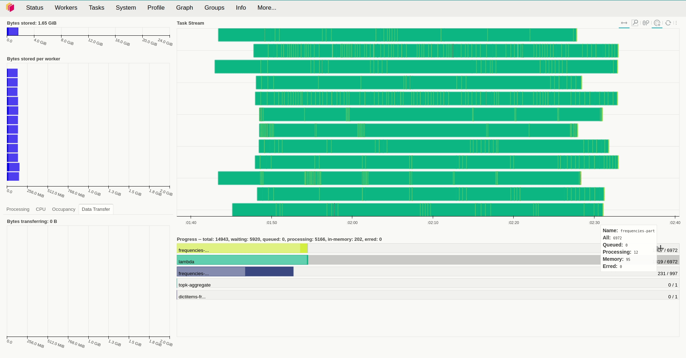
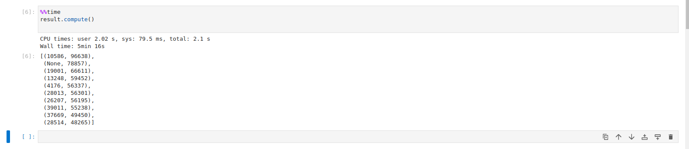
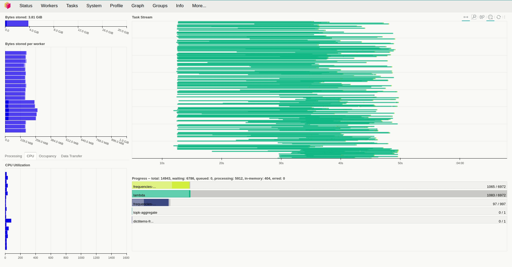
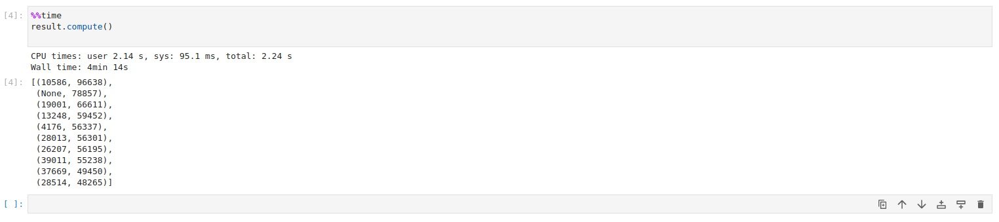

Khi nhắc đến xử lý dữ liệu bảng thì đa số chúng ta sẽ lựa chọn Pandas để đọc và thao tác với dữ liệu, và mình cũng không ngoại lệ. Tuy vậy khi nhu cầu xử lý tăng dần theo số lượng, ta sẽ cần tìm kiếm các thư viện cũng như cách thức triển khai khác để tối ưu được lượng tài nguyên cần đầu tư. Bài viết này giới thiệu về Dask và nói chi tiết hơn về cách thư viện này xử lý phân tán trên lượng dữ liệu không nhỏ cũng nhưng cung cấp thêm một số thông tin benchmark cơ bản.

# Tổng quan về `Dask`

## `Dask` là gì?
Dựa trên trang docs của Dask, chúng ta có thể tóm gọn rằng:

> `Dask` is a flexible library for parallel computing in `Python`. 

Tạm dịch là `Dask` được thiết kế để xử lý song song một cách hiệu quả và linh hoạt trên `Python`. Để làm được điều đó `Dask` là sự kết hợp của hai nhóm:
- Tập hợp các API để có thể xử lý song song các dạng dữ liệu quen thuộc như `list`, `numpy array`, `pandas DataFrame`, ... nhằm xử lý chúng trên các môi trường phân tán khác nhau khi toàn bộ dữ liệu không thể xử lý trên một môi trường duy nhất.
- Một bộ lập lịch để tạo các `task graph` nhằm xử lý các `workload` trên tất cả các máy xử lý



## `Dask` xử lý dữ liệu như thế nào?

Tạm bỏ qua `scheduler` vì nó ít nhiều sẽ được nói ở phần sau, ta sẽ cần có một chút thông tin về ba khái niệm mà `Dask` sử dụng để xử lý dữ liệu, bao gồm `DataFrames`, `Bags` và `Arrays`. Cả ba trong số chúng đều có thể tự động sử dụng dữ liệu được phân vùng giữa RAM và đĩa cũng như được phân phối trên nhiều `node` trong một cụm tùy thuộc vào tình trạng sẵn có của tài nguyên tuy vậy chúng sẽ có một số điểm khác biệt như sau:

### `Array`

`Array` của `Dask` là một cài đặt của tập hợp các `Numpy ndarray`, sử dụng các thuật toán chia block để chia dữ liệu thành các `array` nhỏ nhằm xử lý hiệu quả hơn thay vì load toàn bộ vào RAM.



`Dask Array` được sử dụng trong các trường hợp chẳng hạn như ảnh kích thước lớn, xử lý dữ liệu gen, thuật toán số để tối ưu hóa hoặc thống kê, v.v.

Chi tiết tài liệu ta có thể xem tại: https://docs.dask.org/en/stable/array.html

### `Bag`

Tiếp đó, đôi khi bạn sẽ cần nhóm dữ liệu thành các phần và sử dụng các hàm như `map`, `filter`, `fold` và `groupby` và lúc đó `Dask Bag` sẽ là giải pháp tốt để xử lý song song đống dữ liệu trên với memory footprint nhỏ đến đáng kinh ngạc.



`Dask Bag` thường được sử dụng để song song hóa quá trình tính toán đơn giản trên dữ liệu phi cấu trúc hoặc bán cấu trúc như dữ liệu văn bản, dữ liệu log, `JSON` hoặc `Python object` do người dùng định nghĩa.

**PS**: việc chia dữ liệu thành các `Bag` khá giống với `Dynamic Task Mapping` của `Airflow`  nên mình nghĩa có vẻ chúng được sinh ra để cùng xử lý một vấn đề

### `DataFrames`

Và tương tự như `Array`, `DataFrames` của `Dask` là một tập hợp các `DataFrames` của `Pandas`. Các `Pandas DataFrame` này có thể tồn tại trên đĩa để tính toán trong trường hợp bộ nhớ lớn cần thiết để tải toàn bộ chúng nhiều hơn trên một máy hoặc trên nhiều máy khác nhau trong một cụm. Khi ta thao tác với một `Dask DataFrame` thì điều đó sẽ dẫn tới việc thực thi với tất cả các `Pandas DataFrame`  cấu thành.



`Dask DataFrame` được sử dụng trong các tình huống thường cần đến `Pandas` nhưng lại không thể sử dụng trực tiếp thư viện này vì:
- Cần thao tác với các tập dữ liệu lớn, ngay cả khi các tập dữ liệu đó không vừa với bộ nhớ
- Cần tăng tốc tính toán bằng cách sử dụng nhiều `core`

Tuy vậy thì một số trường hợp, việc sử dụng `Dask DataFrame` sẽ không phù hợp mà ta có thể kể đến là:
- Dữ liệu cần xử lý nhỏ
- Dữ liệu là phi cấu trúc hoặc bán cấu trúc
- Các trường hợp khác các bạn có thể search google =))))


## Sử dụng `Dask` như thế nào?
Về cơ bản thì syntax của `Dask` rất quen thuộc với những ai đã từng xử lý dữ liệu bằng một số công cụ kiểu như `numpy` và `pandas`. Chúng ta có thể nhận thấy điều đó khi quan sát một số đoạn mã sau: 

- `DataFrame` của `Dask` có thể xử lý giống hệt như của `Pandas`

```python
import pandas as pd                     import dask.dataframe as dd
df = pd.read_csv('2015-01-01.csv')      df = dd.read_csv('2015-*-*.csv')
df.groupby(df.user_id).value.mean()     df.groupby(df.user_id).value.mean().compute()
```

- Điều này cũng tương tự như khi ta so sánh `Dask Array` với `Numpy`

```python
import numpy as np                       import dask.array as da
f = h5py.File('myfile.hdf5')             f = h5py.File('myfile.hdf5')
x = np.array(f['/small-data'])           x = da.from_array(f['/big-data'],
                                                           chunks=(1000, 1000))
x - x.mean(axis=1)                       x - x.mean(axis=1).compute()
```
-  Tiếp đó cách sử dụng `Dask Bag` tương tự như khi ta sử dụng `groupby` của `iterators` hay sử dụng `PySpark`

```python
import dask.bag as db
b = db.read_text('2015-*-*.json.gz').map(json.loads)
b.pluck('name').frequencies().topk(10, lambda pair: pair[1]).compute()
```

- Các `task` của `Dask` có thể được xử lý bất đồng bộ thông qua `Dask Delayed`

```python
from dask import delayed
L = []
for fn in filenames:                  # Use for loops to build up computation
    data = delayed(load)(fn)          # Delay execution of function
    L.append(delayed(process)(data))  # Build connections between variables

result = delayed(summarize)(L)
result.compute()
```

- Tiếp đó thì chúng cũng thể được gửi đi thông qua  `concurrent.futures`
```python
from dask.distributed import Client
client = Client('scheduler:port')

futures = []
for fn in filenames:
    future = client.submit(load, fn)
    futures.append(future)

summary = client.submit(summarize, futures)
summary.result()
```

# Xử lý phân tán trên cụm nhiều thiết bị với `Dask`
## Tổng quan về cách sử dụng

Các trường hợp sử dụng với `Dask` thì có vô vàn nhưng ta sẽ bàn đến trường hợp khi ta cần:
- Xử lý trên nhiều thiết bị/nhiều thread với độ trễ thấp
- Chia sẻ dữ liệu ngang hàng khi các `worker` có thể chia sẻ dữ liệu với nhau để loại bỏ tắc nghẽn trung tâm
- Triển khai dễ dàng khi được xây dựng thuần túy từ Python và từ đó có thể cài đặt dễ dàng

Khi đó thì `Dask.distributed` sẽ là lựa chọn thích hợp. `Dask.distributed` là một công cụ lập lịch tác vụ động, phân tán, được quản lý tập trung. Với thư viện này, ta sẽ có một  `DaskCluster` gồm `dask scheduler` trung tâm được sử dụng để điều phối các hành động của quá trình xử lý trải rộng trên nhiều máy và được thực thi bởi các `dask worker`.

Về tổng quan thì ta sẽ thấy rằng `Dask.distributed`  hoạt động bất đồng bộ và hướng sự kiện. Chính bản chất này giúp nó linh hoạt xử lý đồng thời nhiều `workload` khác nhau đến từ nhiều người dùng cùng lúc với một nhóm`worker` linh hoạt giao tiếp với nhau để truyền dữ liệu hàng loạt qua `TCP`.



`Dask` sẽ cần đến thư viện `distributed` và ta có thể cài đặt dễ dàng thông qua câu lệnh `python -m pip install dask distributed --upgrade` và sau đó việc tự động gửi các `job` đến cụm `DaskCluster` thông qua việc khởi tạo một `Client` như sau:

```python
from dask.distributed import Client
client = Client()  # set up local cluster on your laptop
```

Khi không có thông tin về  `DaskCluster` được truyền vào, `Dask` sẽ tạo một `DaskCluster` trên môi trường cục bộ để sử dụng. Để có thể sử dụng một `DaskCluster` có sẵn, ta sẽ cần truyền thông tin về `IP` và `port` của `dask scheduler` , khi khởi tạo `client` chẳng hạn như sau:

```python
from dask.distributed import Client
client = Client('127.0.0.1:8786')
```

## Triển khai và sử dụng `DaskCluster` trên `Kubernetes`

Nhờ sự tường minh đến từ thiết kế của `Dask.distributed`, ta có thể dễ dàng lựa chọn phương pháp thích hợp nhằm triển khai `DaskCluster` lên hệ thống của mình như được liệt kê trong bài viết [Deploy Dask Clusters](https://docs.dask.org/en/latest/deploying.html) và trong bài viết này mình sẽ lựa chọn việc triển khai `DaskCluster` trên `Kubernetes` bởi `Dask` đã chuẩn bị sẵn cho ta `charts` tại https://github.com/dask/helm-chart để triển khai và có thể tùy chỉnh theo nhu cầu của bản thân. Về cơ bản, ta sẽ có hai lựa chọn đển triển khai bao gồm:
- **dask**: Triển khai cho một/một vài người dùng thông qua việc triển khai `Jupyter` and [dask-kubernetes](https://github.com/dask/dask-kubernetes). 
- **daskhub**: Triển khai cho nhiều người dùng thông qua việc triển khai một `JupyterHub` and [dask-gateway](https://github.com/dask/dask-gateway).

Và tất nhiên với nhu cầu demo thì mình sẽ lựa chọn **dask** rồi. Tiếp đó, dựa trên [các giá trị mặc định được định nghĩa trước](https://github.com/dask/helm-chart/blob/main/dask/values.yaml), ta sẽ có một số thứ cần quan tâm và sẽ cần điều chỉnh một chút nếu chưa phù hợp:
- `scheduler`: Bên cạnh các thông tin về `container` sẽ được sử dụng, tài nguyên được cấp phát thì  có một giá trị cần quan tâm đến là `serviceType` khi đây sẽ là giá trị sử dụng để định nghĩa loại [Kubernetes Service](https://kubernetes.io/docs/concepts/services-networking/service/) được sử dụng để expose port `8786` mà `scheduler` đang lắng nghe các request gửi đến nhằm submit các công việc lên `DaskCluster`
- `webUI`: Bên cạnh port `8786`,  `scheduler` sẽ có thêm một `Web UI` được chạy ở port `8787` và các thông tin trong phần `webUI` sẽ được sử dụng để cấu hình `Kubernetes Service` cho dịch vụ web này
- `worker`: Đối với trường này thì một số trường cần quan tâm sẽ là:
    - `replicas`: số lượng `worker`
    - `threads_per_worker`: số `thread` của mỗi `worker`, nếu không được đặt thì giá trị này sẽ được tính bằng công thức `resources.limits.cpu / default_resources.limits.cpu`
    - `resources`: tài nguyên được cấp phát
    - `env`: định nghĩa các biến môi trường, lưu ý là các `worker` sẽ cài thêm các thư viện cần thiết thông qua các biến `EXTRA_APT_PACKAGES`, `EXTRA_CONDA_PACKAGES`, `EXTRA_PIP_PACKAGES`
 - `jupyter`: cấu hình cho `jupyter` cũng không có gì đáng chú ý trừ việc ta sẽ cần thêm một số thông tin chẳng hạn như `c.NotebookApp.allow_origin="domain của bạn"` vào `extraConfig` nếu có `jupyter` chặn `Cross Origin` và khiến cho `websocket` bị tạch.

Ok vậy là xong đống lý thuyết rồi. Tiếp đó ta sẽ có một vài thử nghiệm để kiểm tra xem việc đặt số lượng `worker` và số `thread` mỗi `worker` sẽ ảnh hưởng như thế nào đến tốc độ xử lý. 

Đầu tiên, ta sẽ có một cụm gồm 4 `node` đã được triển khai với tài nguyên như sau, tuy vậy thì lưu ý rằng không phải toàn bộ lượng tài nguyên này sẽ được cấp phát cho các dịch vụ trong `DaskCluster`:

 ```bash
kubectl get nodes -o='custom-columns=NodeName:.metadata.name,CPU:.status.capacity.cpu,Memory:.status.capacity.memory'

NodeName     CPU   Memory
n120***-pc   6     16261968Ki
b122***-pc   12    32640804Ki
b122***-pc   6     32824612Ki
sun          4     8148268Ki
```

Để đo lường hiệu năng, ta sẽ sử dụng dữ liệu gồm xấp xỉ 34 triệu bản ghi được lưu trữ trong một `MongoDB` và được đọc thông qua thư viện [`dash-mongo`](https://github.com/coiled/dask-mongo). Khi đó mã xử lý sẽ như sau:

```python
from dask_mongo import read_mongo, to_mongo
from dask.distributed import Client, progress

client = Client("my-dask-scheduler.dask-system.svc.cluster.local:8786")
client
```

```python
%%time
b = read_mongo(
    connection_kwargs={"host": "đã che", "port": 27017, "username": "đã che", "password": "đã che"},
    database="đã che",
    collection="đã che",
    chunksize=5000,
)
```

Việc đọc dữ liệu sẽ mất tầm ` 4min 14s` và trả về cho chúng ta một đối tượng `b` thuộc kiểu `Dask Bag`. Tuy nhiên ta sẽ tập trung quan tâm về thời gian xử lý của câu lệnh lọc và đếm số lần xuất hiện được cài đặt thông qua đoạn mã sau:

```python
result = (b.map(lambda record: None if "post_id" not in record else record["post_id"])
           .frequencies(sort=True)
           .topk(10, key=1)

%%time
result.compute()
```

Lưu ý là `Dask` sẽ xử lý khi ta gọi `compute()` của đối tượng `Dask Bag` mà ở đây là là `result`. Với việc sử dụng `replicas=12` và giá trị mặc định với `resources.limits.cpu=1` và `default_resources.cpu=1`, giá trị của `threads_per_worker` không được đặt tức là bằng `1/1=1` thì ta mất hơn 9 phút để xử lý toàn bộ số dữ liệu trên. 





Khi kiểm tra lượng tài nguyên sử dụng trong quá trình hoạt động, ta sẽ thấy rằng các `worker` sử dụng khá ít tài nguyên để xử lý các `task` trong trường hợp trên khi chúng hầu như chỉ chiếm tầm `50m CPU` và sử dụng lượng RAM là`250 Mi` để hoạt động. Vậy nên câu hỏi đặt ra là  liệu tăng số `thread` và số `worker` lên thì có tăng được tốc độ xử lý lên không? Để giải đáp câu hỏi này, ở lần thử nghiệm thứ 2, mình tăng `replicas=20`, giữ nguyên số lượng `thread` của mỗi `worker` và giảm lượng tài nguyên được cấp phát cho chúng xuống. Kết quả cho thấy thời gian xử lý giảm đáng kể, khi ta chỉ mất hơn 5 phút để xử lý cùng lượng dữ liệu trên.



Thế nên ta thể kỳ vọng rằng việc tăng số `thread` mỗi `worker` có thể tiếp tục giảm thời gian xử lý và thật vậy, việc đặt `threads_per_worker=4` đã giảm thời gian xử lý xuống còn 4 phút.





Có thể hiệu năng của quá trình hoạt động sẽ ảnh hưởng bởi dịch vụ `MongoDB` đã được triển khai bởi có vẻ như các `worker` sẽ chỉ thực sự tải dữ liệu về khi bắt đầu xử lý. Về chi tiết hiệu năng của `Dask` mọi người có thể tham khảo tại bài viết https://blog.dask.org/2017/07/03/scaling để biết được với thiết kế tổng quan của mình thì `Dask` sẽ hoạt động tốt trong những trường hợp nào (mặc dù nó khá là cũ).

# Tổng kết

Bài viết này giới thiệu về `Dask` cũng như đi sâu hơn vào giới thiệu về cách sử dụng `Dask.distributed` nhằm xử lý các dữ liệu dạng bảng với kích thước lớn mà việc xử lý trên môi trường cục bộ cùng với các thư viện quen thuộc như `Pandas` khó có thể giải quyết được. Nhìn chung, mặc dù khó có thể so sánh về mặt hiệu năng với các giải pháp liên quan đến việc xử lý dữ liệu lớn như `Hadoop` nhưng ta có thể liệt kê khá nhiều ưu điểm của `Dask` như hiệu năng tốt, dễ dàng sử dụng và triển khai nhờ sự tường mình của chính thư viện này. Bài viết này đến đây là kết thúc, cảm ơn mọi người đã giành thời gian đọc.

# Tài liệu tham khảo

- https://viblo.asia/p/pandas-dask-va-datatable-package-nao-hieu-qua-va-huu-ich-hon-bWrZnQxpKxw
- https://docs.dask.org/en/stable/
- https://distributed.dask.org/en/stable/
- https://www.nvidia.com/en-us/glossary/data-science/dask/
- https://blog.dask.org/2017/07/03/scaling
- https://tomaugspurger.github.io/slides/scalable-ml.pdf